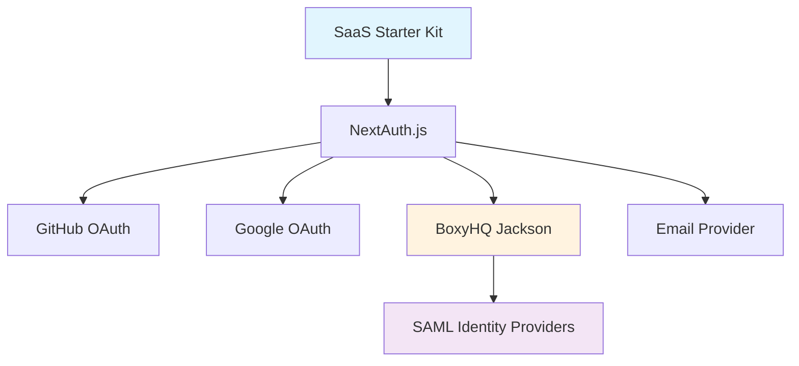
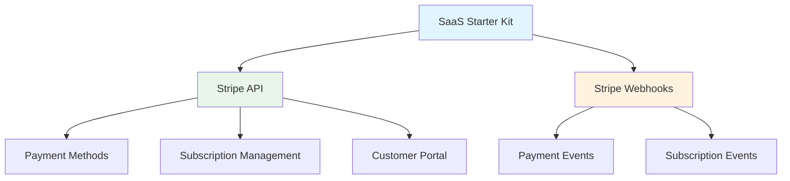
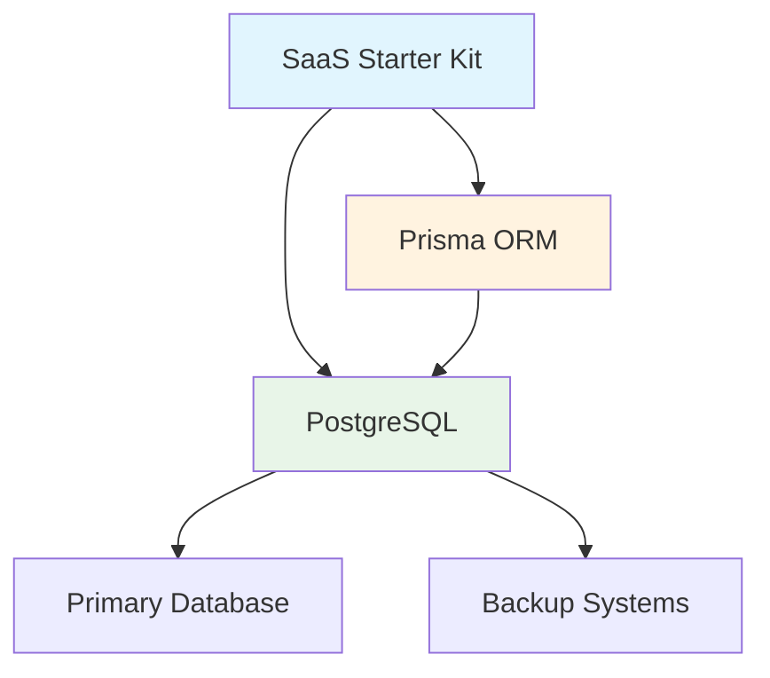
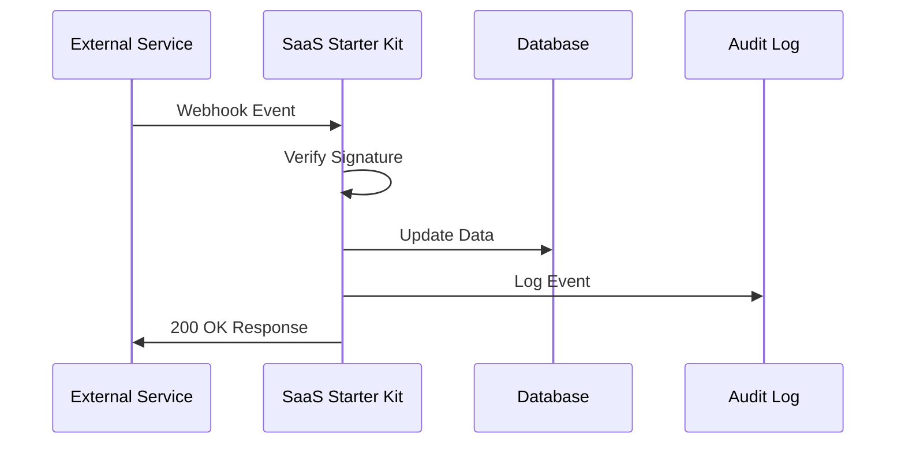
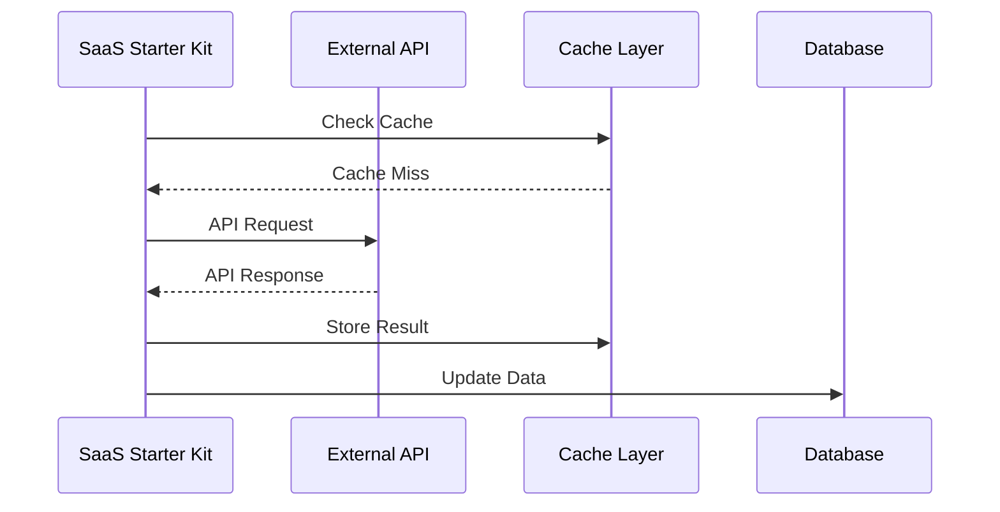

# Stakeholders and External Systems

## Stakeholder Analysis

### Primary Stakeholders

#### Development Teams

- **Role**: Build and maintain SaaS applications using the starter kit
- **Interests**: Code quality, documentation, extensibility, performance
- **Influence**: High - primary users of the system
- **Concerns**: Learning curve, customization capabilities, technical debt

#### Product Teams

- **Role**: Define product requirements and user experience
- **Interests**: Feature completeness, user experience, business value
- **Influence**: High - drive feature requirements
- **Concerns**: Time to market, competitive features, user adoption

#### DevOps/SRE Teams

- **Role**: Deploy, monitor, and maintain production systems
- **Interests**: Reliability, observability, scalability, security
- **Influence**: Medium - infrastructure and deployment decisions
- **Concerns**: Operational complexity, monitoring, incident response

#### Security Teams

- **Role**: Ensure security compliance and risk management
- **Interests**: Security best practices, compliance, audit trails
- **Influence**: High - security requirements are non-negotiable
- **Concerns**: Vulnerability management, compliance standards, access control

#### Business Stakeholders

- **Role**: Define business requirements and success metrics
- **Interests**: Business outcomes, customer satisfaction, revenue impact
- **Influence**: High - determine business priorities
- **Concerns**: ROI, customer feedback, competitive positioning

### Secondary Stakeholders

#### End Users (Team Members)

- **Role**: Daily users of SaaS applications built with the kit
- **Interests**: User experience, reliability, feature availability
- **Influence**: Medium - user feedback drives improvements
- **Concerns**: Performance, ease of use, feature gaps

#### Enterprise Customers

- **Role**: Organizations purchasing SaaS solutions
- **Interests**: Security, compliance, integration capabilities, support
- **Influence**: High - enterprise requirements drive many features
- **Concerns**: Security certifications, audit capabilities, SSO integration

#### Compliance Officers

- **Role**: Ensure regulatory compliance (GDPR, SOC2, etc.)
- **Interests**: Audit trails, data protection, compliance features
- **Influence**: Medium - compliance requirements affect architecture
- **Concerns**: Audit readiness, data governance, regulatory changes

## External System Dependencies

### Critical Dependencies

#### Authentication Providers

**GitHub OAuth**

- **Service**: GitHub OAuth 2.0
- **Purpose**: Developer-friendly authentication
- **Criticality**: Medium - alternative providers available
- **SLA**: GitHub's OAuth service availability
- **Fallback**: Google OAuth, email authentication

**Google OAuth**

- **Service**: Google OAuth 2.0
- **Purpose**: Consumer and business authentication
- **Criticality**: Medium - alternative providers available
- **SLA**: Google's OAuth service availability
- **Fallback**: GitHub OAuth, email authentication

**SAML Identity Providers**

- **Service**: Enterprise identity providers (Okta, Azure AD, etc.)
- **Purpose**: Enterprise SSO and directory sync
- **Criticality**: High - required for enterprise customers
- **SLA**: Varies by provider
- **Fallback**: Manual user management, OAuth alternatives

#### Payment Processing

**Stripe**

- **Service**: Payment processing and subscription management
- **Purpose**: Billing, subscriptions, payment methods
- **Criticality**: High - core business functionality
- **SLA**: 99.99% uptime (Stripe SLA)
- **Fallback**: Manual billing processes, alternative payment processors

#### Database Systems

**PostgreSQL**

- **Service**: Primary database system
- **Purpose**: Data persistence, team isolation, transactions
- **Criticality**: Critical - system cannot function without database
- **SLA**: Depends on hosting provider
- **Fallback**: Database backups, disaster recovery procedures

### Important Dependencies

#### Monitoring and Observability

- **Sentry**: Error monitoring and performance tracking
- **Mixpanel**: User analytics and product metrics
- **OpenTelemetry**: Metrics collection and distributed tracing
- **Criticality**: Medium - affects visibility, not core functionality

#### Communication Services

- **Email SMTP**: Transactional email delivery
- **Slack**: Internal notifications and alerts
- **Criticality**: Medium - alternative communication methods available

#### Security Services

- **Google reCAPTCHA**: Bot protection and form security
- **Criticality**: Low - can be disabled with increased security risk

#### Audit and Compliance

- **Retraced**: Audit logging and compliance reporting
- **Criticality**: High for enterprise customers - affects compliance

### Integration Patterns

#### Webhook-based Integrations

**Stripe Webhooks**

- **Events**: Payment successful, subscription updated, customer created
- **Security**: Webhook signature verification
- **Retry logic**: Automatic retries for failed webhooks
- **Idempotency**: Event deduplication to prevent duplicate processing

**SAML Assertions**

- **Flow**: IdP-initiated and SP-initiated SSO
- **Security**: SAML signature verification, assertion validation
- **User provisioning**: Automatic user creation and team assignment
- **Directory sync**: SCIM 2.0 for user and group synchronization

#### API-based Integrations

**Outbound API Calls**

- **Authentication**: API keys, OAuth tokens
- **Error handling**: Exponential backoff, circuit breakers
- **Rate limiting**: Respect external service limits
- **Caching**: Cache responses to reduce API calls

### Dependency Risk Assessment

#### High Risk Dependencies

1. **PostgreSQL Database** - Single point of failure
   - **Mitigation**: Database clustering, automated backups, disaster recovery
2. **Stripe Payment Processing** - Business critical

   - **Mitigation**: Payment method redundancy, manual payment processing

3. **Enterprise SAML Identity Providers** - Customer retention critical
   - **Mitigation**: Multiple provider support, fallback authentication

#### Medium Risk Dependencies

1. **External OAuth Providers** - User experience impact

   - **Mitigation**: Multiple provider options, email fallback

2. **Email Service Provider** - Communication disruption

   - **Mitigation**: Multiple SMTP providers, queue-based retry

3. **Monitoring Services** - Operational visibility
   - **Mitigation**: Multiple monitoring tools, manual monitoring processes

#### Low Risk Dependencies

1. **Analytics Services** - Product insights impact

   - **Mitigation**: Multiple analytics providers, data export capabilities

2. **Security Services (reCAPTCHA)** - Security enhancement
   - **Mitigation**: Alternative security measures, IP-based protection

### External System Requirements

#### Integration Standards

- **Authentication**: OAuth 2.0, SAML 2.0, OpenID Connect
- **API Design**: RESTful APIs, webhook standards
- **Data Format**: JSON for API communication, XML for SAML
- **Security**: TLS 1.3, webhook signature verification, API authentication

#### Service Level Requirements

- **Availability**: 99.9% minimum for critical services
- **Response Time**: < 2 seconds for authentication, < 5 seconds for payments
- **Data Consistency**: Eventual consistency acceptable for analytics
- **Security**: SOC 2 Type II compliance for critical services

#### Monitoring and Alerting

- **Service Health**: Monitor external service availability
- **Response Times**: Track API response times and webhook delivery
- **Error Rates**: Monitor integration error rates and retry patterns
- **Business Metrics**: Track successful authentications, payments, user provisioning
