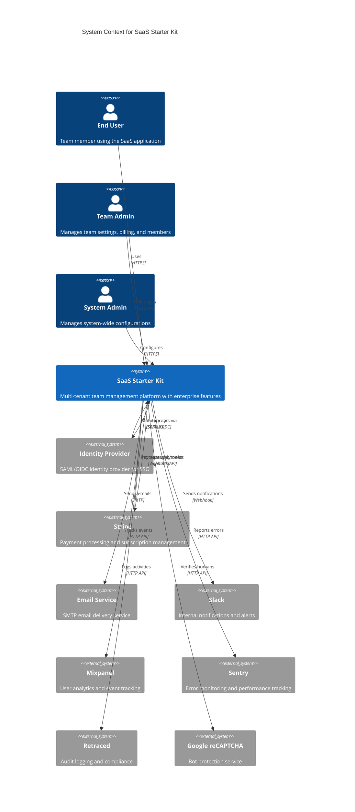

# System Context

## Overview

The SaaS Starter Kit is a **multi-tenant team management platform** that provides enterprise-grade features for building Software-as-a-Service applications. It serves as a foundation for teams building B2B SaaS products requiring authentication, team management, billing, SSO, and compliance features.

## System Context Diagram

## Primary Users

### End Users
- **Team members** who use the application for their daily work
- **Authentication needs**: Single sign-on, multi-factor authentication
- **Access patterns**: Dashboard access, feature usage based on team subscription
- **Key interactions**: Login, team collaboration, account management

### Team Administrators  
- **Team owners and administrators** who manage team settings and membership
- **Management responsibilities**: Team settings, member invitations, billing, integrations
- **Access patterns**: Administrative dashboards, billing portal, member management
- **Key interactions**: Team configuration, subscription management, SSO setup

### System Administrators
- **Platform administrators** who manage system-wide configurations
- **Administrative scope**: Global settings, monitoring, system health
- **Access patterns**: Admin interfaces, system monitoring, configuration management
- **Key interactions**: System configuration, monitoring dashboards, troubleshooting

## External Systems

### Identity Providers (IdP)
- **Purpose**: Enterprise SSO and directory synchronization
- **Protocols**: SAML 2.0, OIDC, SCIM 2.0
- **Integration**: BoxyHQ Jackson for SAML management
- **Data flow**: Authentication assertions, user provisioning, group sync

### Payment Systems
- **Primary**: Stripe for subscription billing and payment processing
- **Features**: Subscription management, payment methods, invoicing, tax handling
- **Integration patterns**: Webhook events, customer portal, payment links
- **Data synchronization**: Subscription status, billing events, customer data

### Communication Services
- **Email delivery**: SMTP-based transactional email (Nodemailer)
- **Internal notifications**: Slack webhooks for system alerts
- **Email templates**: React Email for transactional messaging
- **Notification types**: Account verification, team invitations, billing alerts

### Monitoring and Analytics
- **Error monitoring**: Sentry for error tracking and performance monitoring
- **User analytics**: Mixpanel for product analytics and user behavior
- **Audit logging**: Retraced for compliance and audit trail
- **Performance monitoring**: OpenTelemetry metrics collection

### Security Services
- **Bot protection**: Google reCAPTCHA for form security
- **Authentication security**: Account lockout, rate limiting
- **Infrastructure security**: Security headers, HTTPS enforcement

## System Boundaries

### Authentication Boundary
- **Internal**: NextAuth.js session management, account linking
- **External**: OAuth providers (GitHub, Google), SAML IdPs, email verification
- **Security**: Password hashing, session tokens, account lockout

### Authorization Boundary  
- **Internal**: Role-based access control (RBAC), team-scoped permissions
- **External**: IdP group mappings, feature flags based on billing
- **Enforcement**: Middleware guards, API route protection, UI component access

### Data Boundary
- **Internal**: PostgreSQL database with team-based data isolation
- **External**: Third-party service data synchronization
- **Privacy**: GDPR compliance, data encryption, audit trails

### Integration Boundary
- **Inbound**: Webhooks from Stripe, SAML assertions, SCIM provisioning
- **Outbound**: API calls to external services, webhook deliveries
- **Security**: Signature verification, API authentication, rate limiting

## Key Quality Attributes

### Security
- **Authentication**: Multi-provider support with enterprise SSO
- **Authorization**: Granular RBAC with team isolation
- **Data protection**: Encryption at rest and in transit
- **Compliance**: Audit logging, GDPR compliance features

### Scalability
- **Multi-tenancy**: Team-based data isolation in shared database
- **Performance**: Optimized database queries, caching strategies
- **Infrastructure**: Horizontal scaling capability with containerization

### Reliability
- **Error handling**: Comprehensive error monitoring with Sentry
- **Data consistency**: Database transactions, foreign key constraints
- **Monitoring**: Health checks, performance metrics, alerting

### Maintainability
- **Code organization**: Clean architecture with separation of concerns
- **Type safety**: Full TypeScript implementation
- **Testing**: Unit tests, E2E testing with Playwright
- **Documentation**: Comprehensive API and architecture documentation

## Business Context

### Target Market
- **B2B SaaS companies** requiring enterprise-grade team management
- **Organizations** needing SSO, compliance, and audit capabilities
- **Development teams** building multi-tenant applications

### Business Goals
- **Reduce time-to-market** for SaaS applications
- **Ensure enterprise compliance** with audit and security requirements
- **Enable team collaboration** with robust permission systems
- **Support enterprise sales** with SSO and directory sync capabilities

### Success Metrics
- **Developer productivity**: Time to implement new features
- **Security compliance**: Audit readiness, security certifications
- **Performance**: Application response times, uptime
- **User satisfaction**: Authentication success rates, feature adoption