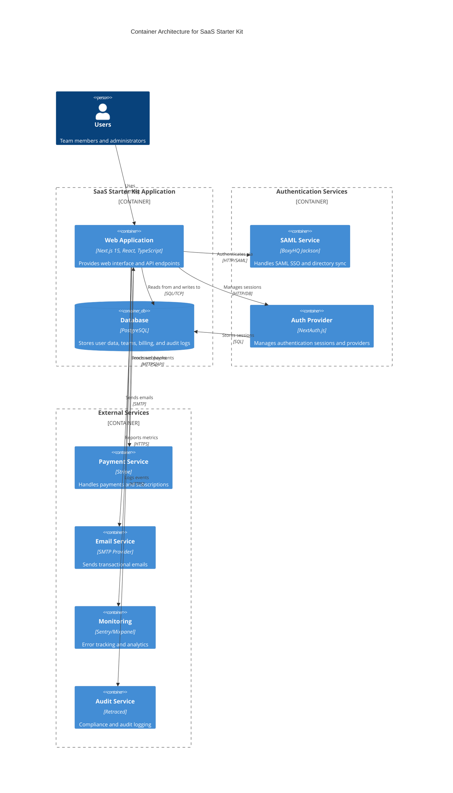
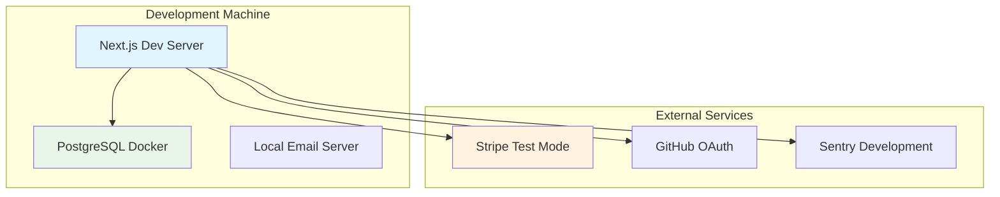
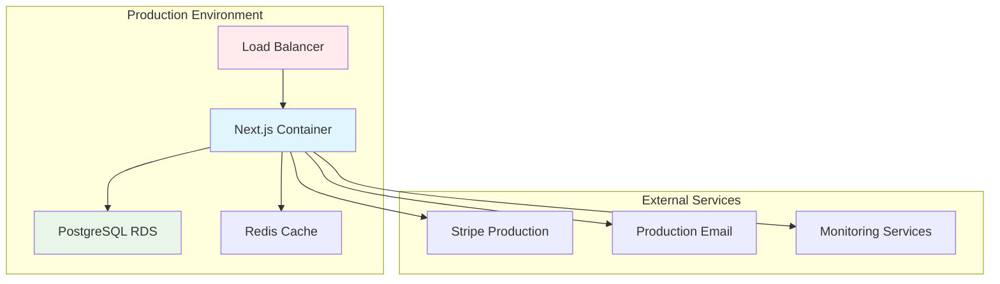
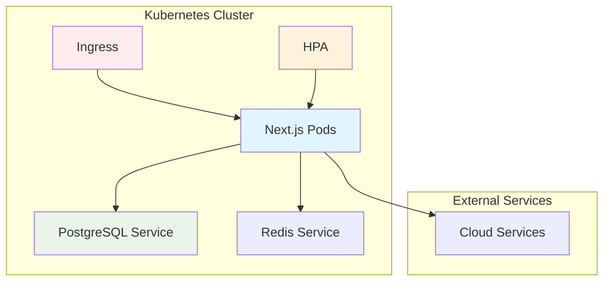
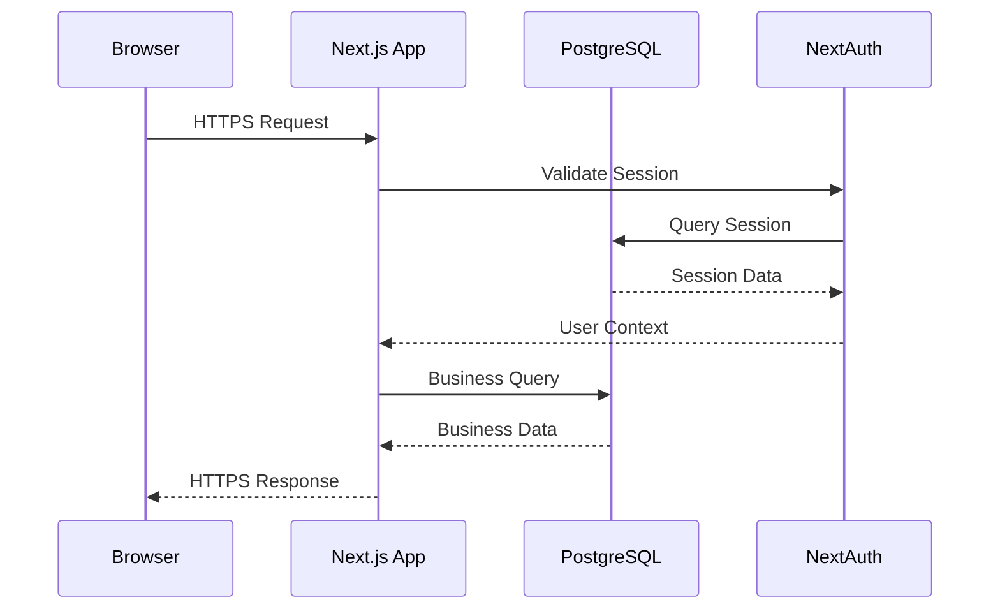
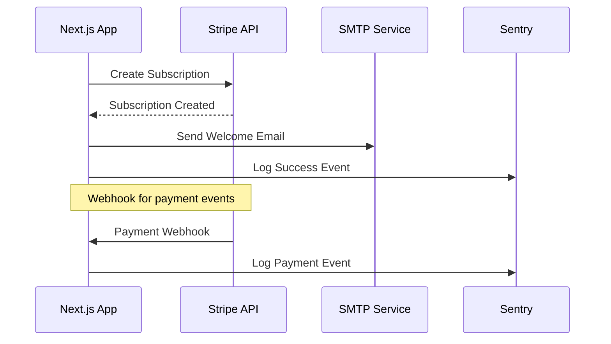

# Container Architecture

## Overview

The SaaS Starter Kit follows a **monolithic Next.js architecture** with clear separation of concerns through containerized deployment. The system is designed as a single application container with external service dependencies, optimized for simplicity while maintaining enterprise-grade capabilities.

## Container Diagram

## Technology Choices

### Core Application Stack

#### Next.js 15 Web Application Container

- **Technology**: Next.js 15 with React 18 and TypeScript
- **Purpose**: Full-stack web application with SSR/SSG capabilities
- **Responsibilities**:
  - Frontend React application with Tailwind CSS + daisyUI
  - Backend API routes for business logic
  - Authentication integration with NextAuth.js
  - Database operations via Prisma ORM

**Rationale for Next.js**:

- **Full-stack capability**: Single framework for frontend and backend
- **Developer experience**: Excellent TypeScript support, hot reloading
- **Performance**: Built-in optimization for images, fonts, and static assets
- **Scalability**: API routes can handle significant load
- **SEO-friendly**: Server-side rendering for better search optimization

#### PostgreSQL Database Container

- **Technology**: PostgreSQL 14+
- **Purpose**: Primary data store with ACID compliance
- **Responsibilities**:
  - Multi-tenant data storage with team-based isolation
  - Session storage for NextAuth.js
  - SAML configuration storage for BoxyHQ Jackson
  - Audit trail and compliance data

**Rationale for PostgreSQL**:

- **Reliability**: ACID compliance and mature ecosystem
- **Performance**: Excellent query optimization and indexing
- **JSON support**: Flexible schema for metadata and configurations
- **Enterprise features**: Row-level security, backup/recovery

### Authentication Architecture

#### NextAuth.js Authentication Provider

- **Technology**: NextAuth.js 4.24 with database sessions
- **Purpose**: Unified authentication across multiple providers
- **Integration**: Embedded within Next.js application
- **Providers**:
  - OAuth (GitHub, Google)
  - Email (magic links)
  - Credentials (username/password)
  - SAML (via BoxyHQ Jackson)

#### BoxyHQ Jackson SAML Service

- **Technology**: BoxyHQ Jackson (enterprise SSO)
- **Deployment**: Can be embedded or deployed separately
- **Purpose**: Enterprise SAML SSO and directory synchronization
- **Features**:
  - SAML 2.0 identity provider integration
  - SCIM 2.0 directory synchronization
  - Multi-tenant SAML configuration

### External Service Integration

#### Payment Processing

- **Service**: Stripe
- **Integration**: RESTful API + webhooks
- **Purpose**: Subscription billing and payment processing
- **Data flow**: Bidirectional API calls and webhook events

#### Communication Services

- **Email**: SMTP via Nodemailer
- **Notifications**: Slack webhooks for internal alerts
- **Purpose**: Transactional emails and system notifications

#### Monitoring and Analytics

- **Error Monitoring**: Sentry for error tracking and performance
- **User Analytics**: Mixpanel for product analytics
- **Metrics**: OpenTelemetry for custom metrics collection
- **Audit Logging**: Retraced for compliance audit trails

## Deployment Architecture

### Development Environment

**Development Setup**:

- **Application**: `npm run dev` on port 4002
- **Database**: Docker Compose PostgreSQL container
- **Email**: Local SMTP server or email service
- **External services**: Test/development mode configurations

### Production Deployment Options

#### Option 1: Single Container Deployment

**Characteristics**:

- **Simplicity**: Single application container
- **Scaling**: Horizontal scaling with load balancer
- **Database**: Managed PostgreSQL (RDS/Cloud SQL)
- **Caching**: Optional Redis for session/data caching

#### Option 2: Container Orchestration

**Characteristics**:

- **Orchestration**: Kubernetes for container management
- **Auto-scaling**: Horizontal Pod Autoscaler based on metrics
- **Service mesh**: Optional for complex networking requirements
- **High availability**: Multi-zone deployment with failover

## Container Responsibilities

### Web Application Container

**Frontend Responsibilities**:

- React component rendering with SSR/SSG
- Client-side routing and state management
- Form handling and validation
- Real-time UI updates via SWR data fetching
- Authentication state management

**Backend Responsibilities**:

- API route handling with Next.js
- Business logic implementation
- Database operations via Prisma ORM
- Third-party service integrations
- Webhook processing and validation

**Cross-cutting Responsibilities**:

- Authentication and authorization
- Error handling and logging
- Performance monitoring
- Security headers and CSRF protection

### Database Container

**Data Storage**:

- User accounts and authentication data
- Team and member management data
- Billing and subscription information
- API keys and webhook configurations
- Audit logs and compliance data

**Data Integrity**:

- Foreign key constraints
- Database transactions
- Data validation at database level
- Backup and disaster recovery

### Authentication Services

**NextAuth.js Responsibilities**:

- Session management (JWT or database)
- Provider integration and account linking
- CSRF protection and security
- Callback URL handling

**BoxyHQ Jackson Responsibilities**:

- SAML assertion processing
- Directory synchronization (SCIM)
- Multi-tenant SSO configuration
- IdP-initiated login handling

## Service Communication Patterns

### Internal Communication

### External Integration

## Scalability Considerations

### Horizontal Scaling

- **Stateless design**: No server-side state beyond database sessions
- **Load balancing**: Multiple application instances behind load balancer
- **Database connections**: Connection pooling via Prisma
- **Session storage**: Database sessions support horizontal scaling

### Vertical Scaling

- **CPU optimization**: Efficient React rendering and API processing
- **Memory management**: Optimized database queries and caching
- **Database performance**: Query optimization and indexing strategy

### Caching Strategy

- **Client-side**: SWR for data fetching and caching
- **CDN**: Static asset caching for images, CSS, JavaScript
- **API caching**: Optional Redis for frequently accessed data
- **Database query caching**: Prisma query result caching

## Security Architecture

### Network Security

- **HTTPS enforcement**: All communication encrypted in transit
- **Security headers**: CSP, HSTS, X-Frame-Options via middleware
- **CORS configuration**: Restricted cross-origin requests
- **Rate limiting**: Protection against abuse and DDoS

### Application Security

- **Input validation**: Zod schemas for API input validation
- **SQL injection prevention**: Parameterized queries via Prisma
- **XSS protection**: React's built-in XSS prevention
- **CSRF protection**: NextAuth.js CSRF tokens

### Authentication Security

- **Password security**: bcrypt hashing with salt
- **Session security**: Secure session cookies, rotation
- **Account protection**: Login attempt limiting, account lockout
- **Multi-factor authentication**: Integration ready for MFA providers

## Technology Rationale

### Why Monolithic Architecture?

1. **Simplicity**: Single codebase, deployment, and monitoring
2. **Development velocity**: Faster iteration and feature development
3. **Cost efficiency**: Lower infrastructure and operational costs
4. **Team size**: Optimal for small to medium development teams

### Why Next.js?

1. **Full-stack capability**: Frontend and backend in single framework
2. **Developer experience**: Excellent tooling and TypeScript support
3. **Performance**: Built-in optimizations and caching
4. **Ecosystem**: Rich ecosystem and community support

### Why PostgreSQL?

1. **Reliability**: ACID compliance and data integrity
2. **Performance**: Excellent query optimization
3. **Features**: JSON support, full-text search, extensibility
4. **Ecosystem**: Mature tooling and extensive documentation

### Migration Path to Microservices

If future growth requires microservices architecture:

1. **Extract authentication service**: Move NextAuth.js and Jackson to separate services
2. **Extract payment service**: Move Stripe integration to dedicated service
3. **Extract notification service**: Move email and Slack to separate service
4. **API Gateway**: Implement API gateway for service communication
5. **Event-driven architecture**: Use message queues for service communication
