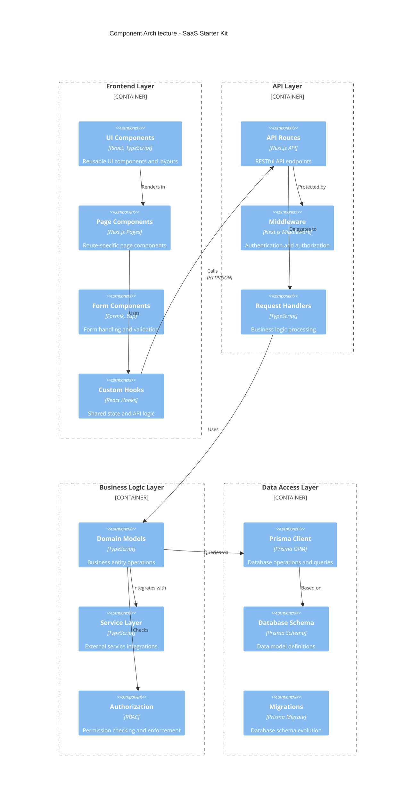
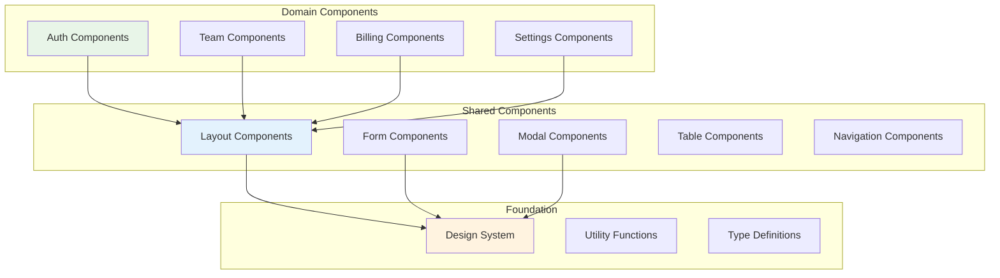
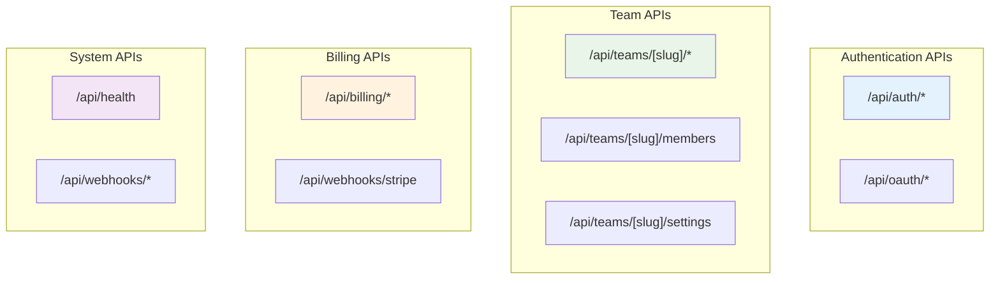

# Component Architecture

## Overview

The SaaS Starter Kit follows a **layered component architecture** with clear separation between presentation, business logic, and data access layers. The architecture emphasizes modularity, reusability, and maintainability through well-defined component boundaries and interfaces.

## Component Diagram



## Frontend Component Architecture

### UI Component Layer



#### Shared UI Components (`/components/shared/`)

**Layout Components**:
```typescript
// components/shared/Layout.tsx
interface LayoutProps {
  children: React.ReactNode;
  title?: string;
  description?: string;
}

export function Layout({ children, title, description }: LayoutProps) {
  return (
    <div className="min-h-screen bg-gray-50">
      <Header />
      <main className="container mx-auto py-8">
        {title && <h1 className="text-3xl font-bold mb-6">{title}</h1>}
        {description && <p className="text-gray-600 mb-8">{description}</p>}
        {children}
      </main>
      <Footer />
    </div>
  );
}
```

**Form Components**:
```typescript
// components/shared/FormField.tsx
interface FormFieldProps {
  label: string;
  name: string;
  type?: string;
  placeholder?: string;
  required?: boolean;
  error?: string;
}

export function FormField({ label, name, type = "text", ...props }: FormFieldProps) {
  return (
    <div className="form-control">
      <label className="label" htmlFor={name}>
        <span className="label-text">{label}</span>
      </label>
      <Field
        id={name}
        name={name}
        type={type}
        className={`input input-bordered ${props.error ? 'input-error' : ''}`}
        {...props}
      />
      <ErrorMessage name={name} component="span" className="label-text-alt text-error" />
    </div>
  );
}
```

#### Domain-Specific Components

**Authentication Components** (`/components/auth/`):
```typescript
// components/auth/LoginForm.tsx
interface LoginFormProps {
  onSuccess?: () => void;
  redirectUrl?: string;
}

export function LoginForm({ onSuccess, redirectUrl }: LoginFormProps) {
  const { data: session, status } = useSession();
  const router = useRouter();

  const validationSchema = Yup.object({
    email: Yup.string().email('Invalid email').required('Email is required'),
    password: Yup.string().min(8, 'Password must be at least 8 characters').required('Password is required')
  });

  const handleSubmit = async (values: LoginFormValues) => {
    const result = await signIn('credentials', {
      email: values.email,
      password: values.password,
      redirect: false
    });

    if (result?.error) {
      setError(result.error);
    } else {
      onSuccess?.();
      router.push(redirectUrl || '/dashboard');
    }
  };

  return (
    <Formik
      initialValues={{ email: '', password: '' }}
      validationSchema={validationSchema}
      onSubmit={handleSubmit}
    >
      <Form className="space-y-4">
        <FormField label="Email" name="email" type="email" />
        <FormField label="Password" name="password" type="password" />
        <button type="submit" className="btn btn-primary w-full">
          Sign In
        </button>
      </Form>
    </Formik>
  );
}
```

**Team Management Components** (`/components/team/`):
```typescript
// components/team/TeamMemberList.tsx
interface TeamMemberListProps {
  teamId: string;
  canManageMembers: boolean;
}

export function TeamMemberList({ teamId, canManageMembers }: TeamMemberListProps) {
  const { data: members, mutate } = useSWR(`/api/teams/${teamId}/members`, fetcher);
  const [isInviting, setIsInviting] = useState(false);

  const handleRemoveMember = async (memberId: string) => {
    await fetch(`/api/teams/${teamId}/members/${memberId}`, { method: 'DELETE' });
    mutate(); // Revalidate data
  };

  return (
    <div className="space-y-4">
      <div className="flex justify-between items-center">
        <h3 className="text-lg font-semibold">Team Members</h3>
        {canManageMembers && (
          <button 
            className="btn btn-primary"
            onClick={() => setIsInviting(true)}
          >
            Invite Member
          </button>
        )}
      </div>

      <div className="overflow-x-auto">
        <table className="table w-full">
          <thead>
            <tr>
              <th>Name</th>
              <th>Email</th>
              <th>Role</th>
              <th>Joined</th>
              {canManageMembers && <th>Actions</th>}
            </tr>
          </thead>
          <tbody>
            {members?.map((member) => (
              <MemberRow 
                key={member.id}
                member={member}
                canManage={canManageMembers}
                onRemove={handleRemoveMember}
              />
            ))}
          </tbody>
        </table>
      </div>

      {isInviting && (
        <InviteMemberModal
          teamId={teamId}
          onClose={() => setIsInviting(false)}
          onSuccess={() => {
            setIsInviting(false);
            mutate();
          }}
        />
      )}
    </div>
  );
}
```

### Custom Hooks Layer (`/hooks/`)

**Data Fetching Hooks**:
```typescript
// hooks/useTeam.ts
export function useTeam(slug: string) {
  const { data, error, mutate } = useSWR(
    slug ? `/api/teams/${slug}` : null,
    fetcher,
    {
      revalidateOnFocus: false,
      dedupingInterval: 60000 // 1 minute
    }
  );

  return {
    team: data,
    isLoading: !error && !data,
    isError: error,
    mutate
  };
}

// hooks/usePermissions.ts
export function usePermissions(teamSlug: string, resource: string) {
  const { data: session } = useSession();
  const { team } = useTeam(teamSlug);

  const permissions = useMemo(() => {
    if (!session?.user || !team) return {};

    const membership = team.members.find(m => m.userId === session.user.id);
    if (!membership) return {};

    return getPermissions(membership.role, resource);
  }, [session, team, resource]);

  return permissions;
}
```

**Form Management Hooks**:
```typescript
// hooks/useFormSubmission.ts
export function useFormSubmission<T>(
  onSubmit: (values: T) => Promise<void>,
  options?: {
    onSuccess?: () => void;
    onError?: (error: Error) => void;
  }
) {
  const [isSubmitting, setIsSubmitting] = useState(false);
  const [error, setError] = useState<string | null>(null);

  const handleSubmit = async (values: T) => {
    setIsSubmitting(true);
    setError(null);

    try {
      await onSubmit(values);
      options?.onSuccess?.();
    } catch (err) {
      const errorMessage = err instanceof Error ? err.message : 'An error occurred';
      setError(errorMessage);
      options?.onError?.(err instanceof Error ? err : new Error(errorMessage));
    } finally {
      setIsSubmitting(false);
    }
  };

  return {
    handleSubmit,
    isSubmitting,
    error,
    setError
  };
}
```

## API Layer Architecture

### API Route Organization (`/pages/api/`)



**API Route Structure**:
```typescript
// pages/api/teams/[slug]/members.ts
import { NextApiRequest, NextApiResponse } from 'next';
import { getServerSession } from 'next-auth';
import { authOptions } from '@/lib/nextAuth';
import { getTeamMembers, addTeamMember, removeTeamMember } from '@/models/team';
import { hasPermission } from '@/lib/permissions';

export default async function handler(req: NextApiRequest, res: NextApiResponse) {
  const session = await getServerSession(req, res, authOptions);
  if (!session?.user) {
    return res.status(401).json({ error: 'Unauthorized' });
  }

  const { slug } = req.query as { slug: string };

  try {
    switch (req.method) {
      case 'GET':
        return await handleGetMembers(req, res, session.user, slug);
      case 'POST':
        return await handleAddMember(req, res, session.user, slug);
      case 'DELETE':
        return await handleRemoveMember(req, res, session.user, slug);
      default:
        return res.status(405).json({ error: 'Method not allowed' });
    }
  } catch (error) {
    console.error('API Error:', error);
    return res.status(500).json({ error: 'Internal server error' });
  }
}

async function handleGetMembers(
  req: NextApiRequest,
  res: NextApiResponse,
  user: any,
  teamSlug: string
) {
  const canViewMembers = await hasPermission(user.id, teamSlug, 'team:member:read');
  if (!canViewMembers) {
    return res.status(403).json({ error: 'Insufficient permissions' });
  }

  const members = await getTeamMembers(teamSlug);
  return res.status(200).json(members);
}
```

### Middleware Layer (`middleware.ts`)

```typescript
// middleware.ts
import { NextRequest, NextResponse } from 'next/server';
import { getToken } from 'next-auth/jwt';

export async function middleware(request: NextRequest) {
  const { pathname } = request.nextUrl;

  // Public routes that don't require authentication
  const publicRoutes = ['/auth/signin', '/auth/signup', '/auth/forgot-password'];
  if (publicRoutes.some(route => pathname.startsWith(route))) {
    return NextResponse.next();
  }

  // API routes authentication
  if (pathname.startsWith('/api/')) {
    return await handleApiAuth(request);
  }

  // Page routes authentication
  if (pathname.startsWith('/teams/') || pathname.startsWith('/dashboard')) {
    return await handlePageAuth(request);
  }

  return NextResponse.next();
}

async function handleApiAuth(request: NextRequest) {
  const token = await getToken({ req: request });
  
  if (!token) {
    return NextResponse.json({ error: 'Unauthorized' }, { status: 401 });
  }

  // Add user context to headers for API routes
  const requestHeaders = new Headers(request.headers);
  requestHeaders.set('x-user-id', token.sub!);
  requestHeaders.set('x-user-email', token.email!);

  return NextResponse.next({
    request: {
      headers: requestHeaders,
    },
  });
}

async function handlePageAuth(request: NextRequest) {
  const token = await getToken({ req: request });
  
  if (!token) {
    const url = request.nextUrl.clone();
    url.pathname = '/auth/signin';
    url.searchParams.set('callbackUrl', request.nextUrl.pathname);
    return NextResponse.redirect(url);
  }

  return NextResponse.next();
}

export const config = {
  matcher: [
    '/api/:path*',
    '/teams/:path*',
    '/dashboard/:path*',
    '/billing/:path*',
    '/settings/:path*'
  ]
};
```

## Business Logic Layer

### Domain Models (`/models/`)

```typescript
// models/team.ts
import { prisma } from '@/lib/prisma';
import { throwIfNotAllowed } from '@/lib/permissions';
import { sendEvent } from '@/lib/svix';
import { logger } from '@/lib/logger';

export interface CreateTeamParams {
  name: string;
  slug: string;
  ownerId: string;
}

export async function createTeam(params: CreateTeamParams) {
  const { name, slug, ownerId } = params;

  // Validate team slug availability
  const existingTeam = await prisma.team.findUnique({ where: { slug } });
  if (existingTeam) {
    throw new Error('Team slug already exists');
  }

  // Create team with owner membership in transaction
  const team = await prisma.$transaction(async (tx) => {
    const newTeam = await tx.team.create({
      data: {
        name,
        slug,
        members: {
          create: {
            userId: ownerId,
            role: 'OWNER'
          }
        }
      },
      include: {
        members: {
          include: {
            user: {
              select: {
                id: true,
                name: true,
                email: true
              }
            }
          }
        }
      }
    });

    // Create Svix app for webhook management
    await createSvixApp(newTeam.id, newTeam.name);

    return newTeam;
  });

  // Send team creation event
  await sendEvent(team.id, {
    type: 'team.created',
    data: {
      teamId: team.id,
      teamName: team.name,
      ownerId: ownerId
    }
  });

  logger.info('Team created', { teamId: team.id, teamName: team.name, ownerId });

  return team;
}

export async function getTeamMembers(teamSlug: string, userId: string) {
  await throwIfNotAllowed(userId, teamSlug, 'team:member:read');

  return await prisma.teamMember.findMany({
    where: {
      team: { slug: teamSlug }
    },
    include: {
      user: {
        select: {
          id: true,
          name: true,
          email: true,
          image: true
        }
      }
    },
    orderBy: {
      createdAt: 'asc'
    }
  });
}

export async function inviteTeamMember(
  teamSlug: string,
  inviterUserId: string,
  email: string,
  role: 'ADMIN' | 'MEMBER'
) {
  await throwIfNotAllowed(inviterUserId, teamSlug, 'team:member:create');

  const team = await prisma.team.findUnique({
    where: { slug: teamSlug },
    select: { id: true, name: true }
  });

  if (!team) {
    throw new Error('Team not found');
  }

  // Check if user is already a member
  const existingMember = await prisma.teamMember.findFirst({
    where: {
      teamId: team.id,
      user: { email }
    }
  });

  if (existingMember) {
    throw new Error('User is already a team member');
  }

  // Create invitation
  const invitation = await prisma.invitation.create({
    data: {
      email,
      role,
      teamId: team.id,
      invitedBy: inviterUserId,
      token: generateInvitationToken(),
      expires: new Date(Date.now() + 7 * 24 * 60 * 60 * 1000) // 7 days
    }
  });

  // Send invitation email
  await sendInvitationEmail({
    email,
    teamName: team.name,
    invitationToken: invitation.token,
    role
  });

  // Send webhook event
  await sendEvent(team.id, {
    type: 'team.member.invited',
    data: {
      teamId: team.id,
      email,
      role,
      invitedBy: inviterUserId
    }
  });

  logger.info('Team member invited', { 
    teamId: team.id, 
    email, 
    role, 
    invitedBy: inviterUserId 
  });

  return invitation;
}
```

### Service Layer (`/lib/services/`)

```typescript
// lib/services/StripeService.ts
import Stripe from 'stripe';
import { prisma } from '@/lib/prisma';
import { logger } from '@/lib/logger';

export class StripeService {
  private stripe: Stripe;

  constructor() {
    this.stripe = new Stripe(process.env.STRIPE_SECRET_KEY!, {
      apiVersion: '2023-10-16'
    });
  }

  async createCustomer(teamId: string, email: string, name: string) {
    try {
      const customer = await this.stripe.customers.create({
        email,
        name,
        metadata: {
          teamId
        }
      });

      // Store customer ID in database
      await prisma.team.update({
        where: { id: teamId },
        data: { stripeCustomerId: customer.id }
      });

      logger.info('Stripe customer created', { teamId, customerId: customer.id });
      return customer;
    } catch (error) {
      logger.error('Failed to create Stripe customer', { teamId, error });
      throw new Error('Failed to create customer');
    }
  }

  async createSubscription(customerId: string, priceId: string) {
    try {
      const subscription = await this.stripe.subscriptions.create({
        customer: customerId,
        items: [{ price: priceId }],
        payment_behavior: 'default_incomplete',
        payment_settings: { save_default_payment_method: 'on_subscription' },
        expand: ['latest_invoice.payment_intent']
      });

      return subscription;
    } catch (error) {
      logger.error('Failed to create subscription', { customerId, priceId, error });
      throw new Error('Failed to create subscription');
    }
  }

  async handleWebhook(event: Stripe.Event) {
    try {
      switch (event.type) {
        case 'customer.subscription.created':
          await this.handleSubscriptionCreated(event.data.object as Stripe.Subscription);
          break;
        case 'customer.subscription.updated':
          await this.handleSubscriptionUpdated(event.data.object as Stripe.Subscription);
          break;
        case 'invoice.payment_succeeded':
          await this.handlePaymentSucceeded(event.data.object as Stripe.Invoice);
          break;
        default:
          logger.warn('Unhandled webhook event type', { type: event.type });
      }
    } catch (error) {
      logger.error('Webhook handling failed', { eventType: event.type, error });
      throw error;
    }
  }

  private async handleSubscriptionCreated(subscription: Stripe.Subscription) {
    const customerId = subscription.customer as string;
    
    // Find team by customer ID
    const team = await prisma.team.findFirst({
      where: { stripeCustomerId: customerId }
    });

    if (!team) {
      logger.error('Team not found for subscription', { customerId });
      return;
    }

    // Update team with subscription info
    await prisma.team.update({
      where: { id: team.id },
      data: {
        stripeSubscriptionId: subscription.id,
        billingStatus: subscription.status,
        billingPeriodStart: new Date(subscription.current_period_start * 1000),
        billingPeriodEnd: new Date(subscription.current_period_end * 1000)
      }
    });

    logger.info('Subscription created', { teamId: team.id, subscriptionId: subscription.id });
  }
}
```

## Data Access Layer

### Prisma Schema Organization (`/prisma/schema.prisma`)

```prisma
// This is your Prisma schema file

generator client {
  provider = "prisma-client-js"
}

datasource db {
  provider = "postgresql"
  url      = env("DATABASE_URL")
}

// User and Authentication Models
model User {
  id            String    @id @default(cuid())
  name          String?
  email         String    @unique
  emailVerified DateTime?
  image         String?
  password      String?
  
  // Account lockout
  lockedAt      DateTime?
  loginAttempts Int       @default(0)
  
  // Relationships
  accounts      Account[]
  sessions      Session[]
  teamMembers   TeamMember[]
  invitations   Invitation[] @relation("InvitedBy")
  apiKeys       ApiKey[]
  
  createdAt DateTime @default(now())
  updatedAt DateTime @updatedAt

  @@map("users")
}

model Account {
  id                String  @id @default(cuid())
  userId            String  @map("user_id")
  type              String
  provider          String
  providerAccountId String  @map("provider_account_id")
  refresh_token     String? @db.Text
  access_token      String? @db.Text
  expires_at        Int?
  token_type        String?
  scope             String?
  id_token          String? @db.Text
  session_state     String?

  user User @relation(fields: [userId], references: [id], onDelete: Cascade)

  @@unique([provider, providerAccountId])
  @@map("accounts")
}

// Team and Multi-tenancy Models
model Team {
  id   String @id @default(cuid())
  name String
  slug String @unique
  
  // Billing
  stripeCustomerId     String?
  stripeSubscriptionId String?
  billingStatus        String?
  billingPeriodStart   DateTime?
  billingPeriodEnd     DateTime?
  
  // Features
  features Json @default("{}")
  
  // Relationships
  members     TeamMember[]
  invitations Invitation[]
  apiKeys     ApiKey[]
  webhooks    Webhook[]
  
  createdAt DateTime @default(now())
  updatedAt DateTime @updatedAt

  @@map("teams")
}

model TeamMember {
  id     String @id @default(cuid())
  userId String @map("user_id")
  teamId String @map("team_id")
  role   Role   @default(MEMBER)
  
  user User @relation(fields: [userId], references: [id], onDelete: Cascade)
  team Team @relation(fields: [teamId], references: [id], onDelete: Cascade)
  
  createdAt DateTime @default(now())
  updatedAt DateTime @updatedAt

  @@unique([userId, teamId])
  @@map("team_members")
}

enum Role {
  OWNER
  ADMIN
  MEMBER
}

// API and Integration Models
model ApiKey {
  id          String   @id @default(cuid())
  name        String
  hashedKey   String   @unique
  teamId      String   @map("team_id")
  userId      String   @map("user_id")
  lastUsedAt  DateTime?
  expiresAt   DateTime?
  
  team Team @relation(fields: [teamId], references: [id], onDelete: Cascade)
  user User @relation(fields: [userId], references: [id], onDelete: Cascade)
  
  createdAt DateTime @default(now())
  updatedAt DateTime @updatedAt

  @@map("api_keys")
}

model Webhook {
  id          String @id @default(cuid())
  teamId      String @map("team_id")
  endpointId  String @unique
  url         String
  eventTypes  Json   @default("[]")
  active      Boolean @default(true)
  
  team Team @relation(fields: [teamId], references: [id], onDelete: Cascade)
  
  createdAt DateTime @default(now())
  updatedAt DateTime @updatedAt

  @@map("webhooks")
}
```

### Database Query Optimization

```typescript
// lib/prisma.ts
import { PrismaClient } from '@prisma/client';
import { logger } from './logger';

const globalForPrisma = globalThis as unknown as {
  prisma: PrismaClient | undefined;
};

export const prisma = globalForPrisma.prisma ?? new PrismaClient({
  log: [
    { level: 'query', emit: 'event' },
    { level: 'error', emit: 'stdout' },
    { level: 'warn', emit: 'stdout' }
  ]
});

// Query performance monitoring
prisma.$on('query', (e) => {
  const duration = e.duration;
  
  if (duration > 1000) { // Log slow queries (> 1 second)
    logger.warn('Slow database query detected', {
      query: e.query,
      params: e.params,
      duration: `${duration}ms`
    });
  }
  
  // Log all queries in development
  if (process.env.NODE_ENV === 'development') {
    logger.debug('Database query', {
      query: e.query,
      duration: `${duration}ms`
    });
  }
});

if (process.env.NODE_ENV !== 'production') globalForPrisma.prisma = prisma;
```

## Component Dependencies and Interfaces

### Type Definitions (`/types/`)

```typescript
// types/team.ts
export interface Team {
  id: string;
  name: string;
  slug: string;
  stripeCustomerId?: string;
  stripeSubscriptionId?: string;
  billingStatus?: string;
  features: Record<string, boolean>;
  members: TeamMember[];
  createdAt: Date;
  updatedAt: Date;
}

export interface TeamMember {
  id: string;
  userId: string;
  teamId: string;
  role: 'OWNER' | 'ADMIN' | 'MEMBER';
  user: {
    id: string;
    name: string | null;
    email: string;
    image: string | null;
  };
  createdAt: Date;
  updatedAt: Date;
}

export interface CreateTeamRequest {
  name: string;
  slug: string;
}

export interface InviteMemberRequest {
  email: string;
  role: 'ADMIN' | 'MEMBER';
}
```

### Error Handling Patterns

```typescript
// lib/errors.ts
export class AppError extends Error {
  constructor(
    message: string,
    public statusCode: number = 500,
    public code?: string
  ) {
    super(message);
    this.name = 'AppError';
  }
}

export class ValidationError extends AppError {
  constructor(message: string, public field?: string) {
    super(message, 400, 'VALIDATION_ERROR');
    this.name = 'ValidationError';
  }
}

export class AuthorizationError extends AppError {
  constructor(message: string = 'Insufficient permissions') {
    super(message, 403, 'AUTHORIZATION_ERROR');
    this.name = 'AuthorizationError';
  }
}

export class NotFoundError extends AppError {
  constructor(resource: string = 'Resource') {
    super(`${resource} not found`, 404, 'NOT_FOUND');
    this.name = 'NotFoundError';
  }
}

// Global error handler for API routes
export function handleApiError(error: unknown, res: NextApiResponse) {
  if (error instanceof AppError) {
    return res.status(error.statusCode).json({
      error: error.message,
      code: error.code
    });
  }

  // Log unexpected errors
  logger.error('Unexpected API error', { error });
  
  return res.status(500).json({
    error: 'Internal server error',
    code: 'INTERNAL_ERROR'
  });
}
```

This component architecture provides a solid foundation for building scalable, maintainable SaaS applications with clear separation of concerns and well-defined interfaces between layers.