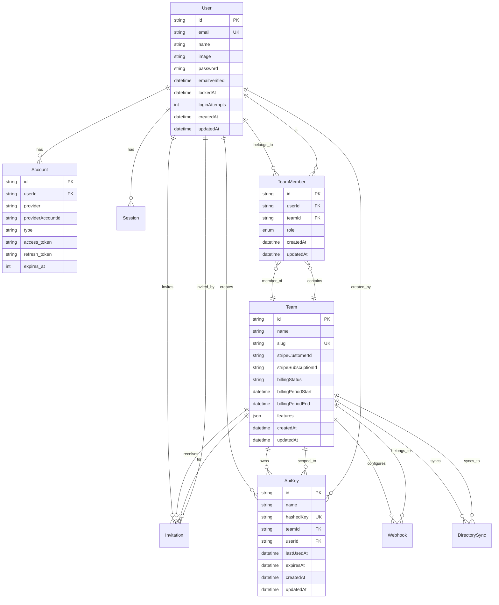
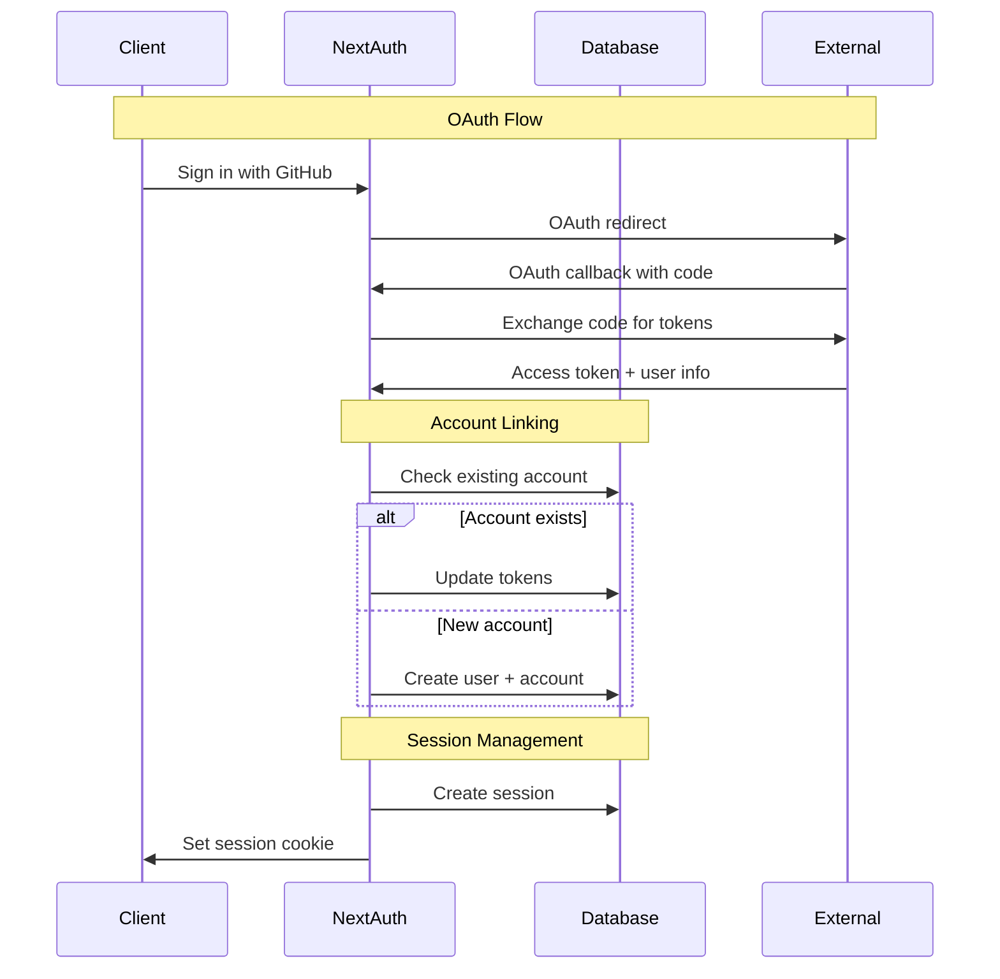
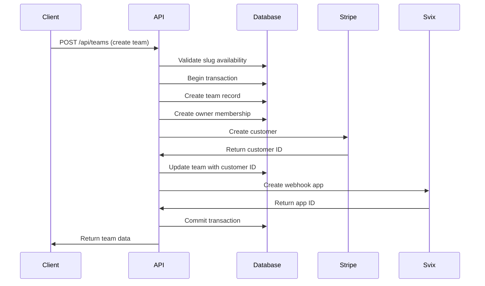
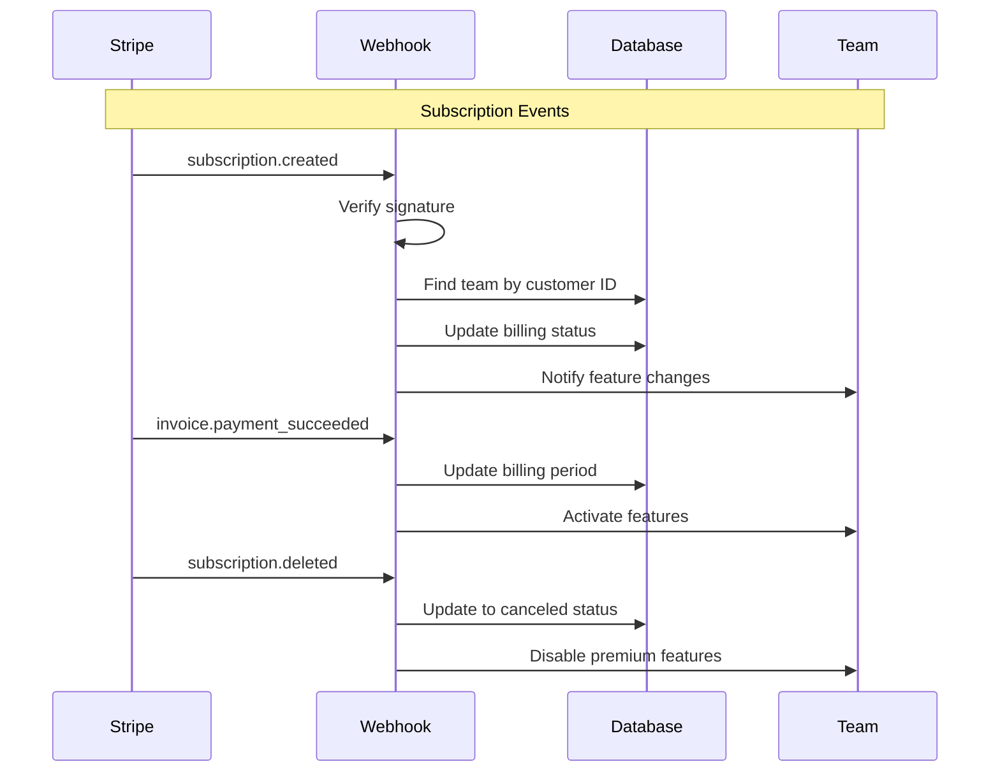

# Data Architecture

## Overview

The SaaS Starter Kit implements a **multi-tenant data architecture** using PostgreSQL with **row-level tenant isolation**. The data model is designed around teams as the primary tenant boundary, with comprehensive audit trails, flexible metadata storage, and optimized query patterns for multi-tenant operations.

## Data Model Overview



## Core Data Models

### User Management

#### User Entity
```sql
CREATE TABLE users (
    id VARCHAR(25) PRIMARY KEY,
    name VARCHAR(255),
    email VARCHAR(255) UNIQUE NOT NULL,
    email_verified TIMESTAMP,
    image TEXT,
    password VARCHAR(255),
    locked_at TIMESTAMP,
    login_attempts INTEGER DEFAULT 0,
    created_at TIMESTAMP DEFAULT NOW(),
    updated_at TIMESTAMP DEFAULT NOW()
);

-- Indexes for performance
CREATE INDEX idx_users_email ON users(email);
CREATE INDEX idx_users_locked_at ON users(locked_at) WHERE locked_at IS NOT NULL;
CREATE INDEX idx_users_created_at ON users(created_at);
```

**Design Decisions**:
- **CUID for primary keys**: Collision-resistant, URL-safe identifiers
- **Email uniqueness**: Enforced at database level for data integrity
- **Account lockout**: Built-in security with attempt tracking
- **Nullable password**: Supports OAuth-only accounts

#### Account Linking
```sql
CREATE TABLE accounts (
    id VARCHAR(25) PRIMARY KEY,
    user_id VARCHAR(25) NOT NULL REFERENCES users(id) ON DELETE CASCADE,
    type VARCHAR(50) NOT NULL,
    provider VARCHAR(50) NOT NULL,
    provider_account_id VARCHAR(255) NOT NULL,
    refresh_token TEXT,
    access_token TEXT,
    expires_at INTEGER,
    token_type VARCHAR(50),
    scope TEXT,
    id_token TEXT,
    session_state TEXT,
    created_at TIMESTAMP DEFAULT NOW(),
    updated_at TIMESTAMP DEFAULT NOW(),
    
    UNIQUE(provider, provider_account_id)
);

CREATE INDEX idx_accounts_user_id ON accounts(user_id);
CREATE INDEX idx_accounts_provider ON accounts(provider, provider_account_id);
```

### Multi-Tenant Team Model

#### Team Entity
```sql
CREATE TABLE teams (
    id VARCHAR(25) PRIMARY KEY,
    name VARCHAR(255) NOT NULL,
    slug VARCHAR(100) UNIQUE NOT NULL,
    
    -- Billing integration
    stripe_customer_id VARCHAR(255),
    stripe_subscription_id VARCHAR(255),
    billing_status VARCHAR(50),
    billing_period_start TIMESTAMP,
    billing_period_end TIMESTAMP,
    
    -- Feature flags and metadata
    features JSONB DEFAULT '{}',
    
    created_at TIMESTAMP DEFAULT NOW(),
    updated_at TIMESTAMP DEFAULT NOW()
);

-- Indexes for multi-tenant queries
CREATE INDEX idx_teams_slug ON teams(slug);
CREATE INDEX idx_teams_stripe_customer ON teams(stripe_customer_id);
CREATE INDEX idx_teams_billing_status ON teams(billing_status);
CREATE INDEX idx_teams_features ON teams USING GIN(features);
```

**Multi-Tenancy Pattern**:
- **Team-based isolation**: All business data scoped to teams
- **Slug-based routing**: Human-readable URLs with `/teams/{slug}/`
- **Feature flags**: JSON column for flexible feature management
- **Billing integration**: Direct Stripe customer mapping

#### Team Membership
```sql
CREATE TYPE role_enum AS ENUM ('OWNER', 'ADMIN', 'MEMBER');

CREATE TABLE team_members (
    id VARCHAR(25) PRIMARY KEY,
    user_id VARCHAR(25) NOT NULL REFERENCES users(id) ON DELETE CASCADE,
    team_id VARCHAR(25) NOT NULL REFERENCES teams(id) ON DELETE CASCADE,
    role role_enum DEFAULT 'MEMBER',
    created_at TIMESTAMP DEFAULT NOW(),
    updated_at TIMESTAMP DEFAULT NOW(),
    
    UNIQUE(user_id, team_id)
);

-- Optimized indexes for permission checks
CREATE INDEX idx_team_members_user_id ON team_members(user_id);
CREATE INDEX idx_team_members_team_id ON team_members(team_id);
CREATE INDEX idx_team_members_role ON team_members(team_id, role);
```

**RBAC Implementation**:
- **Hierarchical roles**: OWNER > ADMIN > MEMBER
- **Composite unique constraint**: Prevents duplicate memberships
- **Optimized for permission queries**: Indexes support fast lookups

## Data Flow Patterns

### Authentication Data Flow



### Team Creation Data Flow



### Billing Data Synchronization



## Data Access Patterns

### Multi-Tenant Query Patterns

#### Team-Scoped Data Access
```typescript
// Safe multi-tenant query pattern
export async function getTeamData(teamSlug: string, userId: string) {
  // Always verify user has access to team
  const teamMember = await prisma.teamMember.findFirst({
    where: {
      user: { id: userId },
      team: { slug: teamSlug }
    },
    include: {
      team: true
    }
  });

  if (!teamMember) {
    throw new AuthorizationError('Access denied to team');
  }

  // All subsequent queries are safe - user is verified team member
  return await prisma.team.findUnique({
    where: { slug: teamSlug },
    include: {
      members: {
        include: {
          user: {
            select: {
              id: true,
              name: true,
              email: true,
              image: true
            }
          }
        }
      },
      apiKeys: true,
      webhooks: true
    }
  });
}
```

#### Optimized Permission Queries
```typescript
// Fast permission checking with single query
export async function getUserPermissions(userId: string, teamSlug: string) {
  const membership = await prisma.teamMember.findFirst({
    where: {
      userId,
      team: { slug: teamSlug }
    },
    select: {
      role: true,
      team: {
        select: {
          id: true,
          features: true
        }
      }
    }
  });

  if (!membership) return null;

  return {
    role: membership.role,
    teamId: membership.team.id,
    features: membership.team.features as Record<string, boolean>
  };
}
```

### Bulk Operations and Transactions

#### Team Member Bulk Invite
```typescript
export async function bulkInviteMembers(
  teamSlug: string,
  invitations: Array<{ email: string; role: Role }>,
  inviterId: string
) {
  return await prisma.$transaction(async (tx) => {
    // Verify inviter permissions
    const inviter = await tx.teamMember.findFirst({
      where: {
        userId: inviterId,
        team: { slug: teamSlug },
        role: { in: ['OWNER', 'ADMIN'] }
      },
      include: { team: true }
    });

    if (!inviter) {
      throw new AuthorizationError('Cannot invite members');
    }

    const results = [];
    
    for (const invitation of invitations) {
      // Check if user already exists
      const existingMember = await tx.teamMember.findFirst({
        where: {
          teamId: inviter.team.id,
          user: { email: invitation.email }
        }
      });

      if (existingMember) {
        results.push({ 
          email: invitation.email, 
          status: 'already_member' 
        });
        continue;
      }

      // Create invitation
      const invite = await tx.invitation.create({
        data: {
          email: invitation.email,
          role: invitation.role,
          teamId: inviter.team.id,
          invitedBy: inviterId,
          token: generateInvitationToken(),
          expires: new Date(Date.now() + 7 * 24 * 60 * 60 * 1000)
        }
      });

      results.push({ 
        email: invitation.email, 
        status: 'invited',
        invitationId: invite.id
      });
    }

    return results;
  });
}
```

## Data Storage Strategies

### JSON Column Usage

#### Feature Flags Storage
```typescript
// Feature flags stored as JSON for flexibility
interface TeamFeatures {
  sso: boolean;
  webhooks: boolean;
  api_access: boolean;
  advanced_billing: boolean;
  directory_sync: boolean;
  audit_logs: boolean;
}

// Type-safe feature access
export function hasFeature(team: Team, feature: keyof TeamFeatures): boolean {
  const features = team.features as TeamFeatures;
  return features[feature] ?? false;
}

// Feature toggle with billing check
export async function enableFeature(
  teamId: string, 
  feature: keyof TeamFeatures, 
  enabled: boolean
) {
  const team = await prisma.team.findUnique({
    where: { id: teamId },
    select: { features: true, billingStatus: true }
  });

  if (!team) throw new NotFoundError('Team');

  // Check if feature is available on current plan
  if (enabled && !isFeatureAvailable(feature, team.billingStatus)) {
    throw new ValidationError('Feature not available on current plan');
  }

  const features = team.features as TeamFeatures;
  features[feature] = enabled;

  await prisma.team.update({
    where: { id: teamId },
    data: { features }
  });
}
```

#### Metadata and Configuration Storage
```typescript
// Flexible metadata storage for external integrations
interface SamlConfiguration {
  entityId: string;
  ssoUrl: string;
  certificate: string;
  attributeMapping: {
    email: string;
    firstName?: string;
    lastName?: string;
  };
}

// Store SAML config in Jackson table with JSON
await prisma.jacksonStore.create({
  data: {
    key: `saml_config:${teamId}`,
    value: JSON.stringify(samlConfig),
    iv: null,
    tag: null
  }
});
```

### Audit Trail Implementation

#### Audit Log Schema
```sql
CREATE TABLE audit_logs (
    id VARCHAR(25) PRIMARY KEY,
    team_id VARCHAR(25) NOT NULL REFERENCES teams(id),
    user_id VARCHAR(25) REFERENCES users(id),
    action VARCHAR(100) NOT NULL,
    resource_type VARCHAR(50) NOT NULL,
    resource_id VARCHAR(255),
    metadata JSONB,
    ip_address INET,
    user_agent TEXT,
    created_at TIMESTAMP DEFAULT NOW()
);

-- Indexes for audit queries
CREATE INDEX idx_audit_logs_team_id ON audit_logs(team_id, created_at DESC);
CREATE INDEX idx_audit_logs_user_id ON audit_logs(user_id, created_at DESC);
CREATE INDEX idx_audit_logs_action ON audit_logs(action, created_at DESC);
CREATE INDEX idx_audit_logs_resource ON audit_logs(resource_type, resource_id);
```

#### Automatic Audit Logging
```typescript
// Prisma middleware for automatic audit logging
prisma.$use(async (params, next) => {
  const result = await next(params);

  // Only audit CUD operations on auditable models
  if (['create', 'update', 'delete'].includes(params.action) &&
      AUDITABLE_MODELS.includes(params.model)) {
    
    await createAuditLog({
      action: `${params.model}.${params.action}`,
      resourceType: params.model,
      resourceId: result?.id || params.args?.where?.id,
      metadata: {
        before: params.action === 'update' ? params.args?.data : null,
        after: params.action !== 'delete' ? result : null
      }
    });
  }

  return result;
});
```

## Performance Optimization

### Database Indexing Strategy

#### Query Pattern Analysis
```sql
-- Most common query patterns and their indexes

-- 1. Team member lookup (permission checks)
-- Query: Find user's role in specific team
SELECT role FROM team_members 
WHERE user_id = ? AND team_id = ?;
-- Index: idx_team_members_user_team (user_id, team_id)

-- 2. Team data access
-- Query: Get team by slug with member check
SELECT t.* FROM teams t 
JOIN team_members tm ON t.id = tm.team_id 
WHERE t.slug = ? AND tm.user_id = ?;
-- Index: idx_teams_slug, idx_team_members_user_id

-- 3. API key validation
-- Query: Find active API key for team
SELECT * FROM api_keys 
WHERE hashed_key = ? AND team_id = ? 
AND (expires_at IS NULL OR expires_at > NOW());
-- Index: idx_api_keys_hash_team (hashed_key, team_id)

-- 4. Audit log queries
-- Query: Get recent team activity
SELECT * FROM audit_logs 
WHERE team_id = ? 
ORDER BY created_at DESC LIMIT 50;
-- Index: idx_audit_logs_team_time (team_id, created_at DESC)
```

#### Composite Index Strategy
```sql
-- Optimized composite indexes for common query patterns
CREATE INDEX idx_team_members_user_team ON team_members(user_id, team_id);
CREATE INDEX idx_team_members_team_role ON team_members(team_id, role);
CREATE INDEX idx_api_keys_team_active ON api_keys(team_id, expires_at) 
    WHERE expires_at IS NULL OR expires_at > NOW();
CREATE INDEX idx_invitations_team_email ON invitations(team_id, email);
```

### Connection Pool Configuration

```typescript
// Prisma connection pool optimization
const prisma = new PrismaClient({
  datasources: {
    db: {
      url: process.env.DATABASE_URL
    }
  },
  // Connection pool settings
  __internal: {
    engine: {
      // Maximum connections to database
      connectionLimit: process.env.DATABASE_CONNECTION_LIMIT ? 
        parseInt(process.env.DATABASE_CONNECTION_LIMIT) : 10,
      
      // Connection timeout
      connectionTimeout: 30000,
      
      // Query timeout
      queryTimeout: 60000
    }
  }
});

// Connection health monitoring
setInterval(async () => {
  try {
    await prisma.$queryRaw`SELECT 1`;
  } catch (error) {
    logger.error('Database connection health check failed', { error });
  }
}, 30000); // Check every 30 seconds
```

### Query Optimization Patterns

#### N+1 Query Prevention
```typescript
// Bad: N+1 query pattern
async function getTeamsWithMemberCount() {
  const teams = await prisma.team.findMany();
  
  // This creates N+1 queries!
  for (const team of teams) {
    team.memberCount = await prisma.teamMember.count({
      where: { teamId: team.id }
    });
  }
  
  return teams;
}

// Good: Single query with aggregation
async function getTeamsWithMemberCountOptimized() {
  return await prisma.team.findMany({
    include: {
      _count: {
        select: {
          members: true
        }
      }
    }
  });
}
```

#### Efficient Pagination
```typescript
// Cursor-based pagination for better performance
export async function getTeamMembers(
  teamSlug: string,
  cursor?: string,
  limit: number = 20
) {
  return await prisma.teamMember.findMany({
    where: {
      team: { slug: teamSlug }
    },
    include: {
      user: {
        select: {
          id: true,
          name: true,
          email: true,
          image: true
        }
      }
    },
    orderBy: {
      createdAt: 'desc'
    },
    take: limit,
    ...(cursor && {
      skip: 1,
      cursor: {
        id: cursor
      }
    })
  });
}
```

## Data Migration Strategy

### Schema Evolution
```typescript
// Migration script example
// migrations/001_add_team_features.sql
BEGIN;

-- Add features column to teams table
ALTER TABLE teams ADD COLUMN features JSONB DEFAULT '{}';

-- Create GIN index for JSON queries
CREATE INDEX idx_teams_features ON teams USING GIN(features);

-- Initialize default features for existing teams
UPDATE teams SET features = '{
  "sso": false,
  "webhooks": true,
  "api_access": true,
  "advanced_billing": false,
  "directory_sync": false,
  "audit_logs": true
}' WHERE features = '{}';

COMMIT;
```

### Data Seeding
```typescript
// prisma/seed.ts
import { PrismaClient } from '@prisma/client';
import { hash } from 'bcryptjs';

const prisma = new PrismaClient();

async function main() {
  // Create admin user
  const adminUser = await prisma.user.create({
    data: {
      email: 'admin@example.com',
      name: 'Admin User',
      password: await hash('admin123', 12),
      emailVerified: new Date()
    }
  });

  // Create default team
  const defaultTeam = await prisma.team.create({
    data: {
      name: 'Default Team',
      slug: 'default',
      features: {
        sso: true,
        webhooks: true,
        api_access: true,
        advanced_billing: true,
        directory_sync: true,
        audit_logs: true
      },
      members: {
        create: {
          userId: adminUser.id,
          role: 'OWNER'
        }
      }
    }
  });

  console.log({ adminUser, defaultTeam });
}

main()
  .catch(console.error)
  .finally(async () => {
    await prisma.$disconnect();
  });
```

## Data Backup and Recovery

### Backup Strategy
```bash
#!/bin/bash
# scripts/backup-database.sh

# Environment variables
DB_NAME="saas_starter_kit"
BACKUP_DIR="/backups"
S3_BUCKET="your-backup-bucket"
DATE=$(date +%Y%m%d_%H%M%S)

# Create full database backup
echo "Starting database backup..."
pg_dump $DATABASE_URL | gzip > "$BACKUP_DIR/full_backup_$DATE.sql.gz"

# Create schema-only backup
pg_dump --schema-only $DATABASE_URL | gzip > "$BACKUP_DIR/schema_backup_$DATE.sql.gz"

# Upload to S3
aws s3 cp "$BACKUP_DIR/full_backup_$DATE.sql.gz" "s3://$S3_BUCKET/daily/"
aws s3 cp "$BACKUP_DIR/schema_backup_$DATE.sql.gz" "s3://$S3_BUCKET/schema/"

# Clean up local backups older than 7 days
find $BACKUP_DIR -name "*.sql.gz" -mtime +7 -delete

echo "Backup completed: full_backup_$DATE.sql.gz"
```

### Point-in-Time Recovery
```bash
#!/bin/bash
# scripts/restore-database.sh

BACKUP_FILE=$1
TARGET_DB="saas_starter_kit_restored"

if [ -z "$BACKUP_FILE" ]; then
    echo "Usage: $0 <backup_file>"
    exit 1
fi

echo "Restoring database from $BACKUP_FILE..."

# Create new database
createdb $TARGET_DB

# Restore from backup
gunzip -c $BACKUP_FILE | psql $TARGET_DB

echo "Database restored to $TARGET_DB"
echo "To switch to restored database:"
echo "1. Stop application"
echo "2. Rename databases: $TARGET_DB -> saas_starter_kit"
echo "3. Start application"
```

This data architecture provides a solid foundation for multi-tenant SaaS applications with proper isolation, performance optimization, and comprehensive audit capabilities.