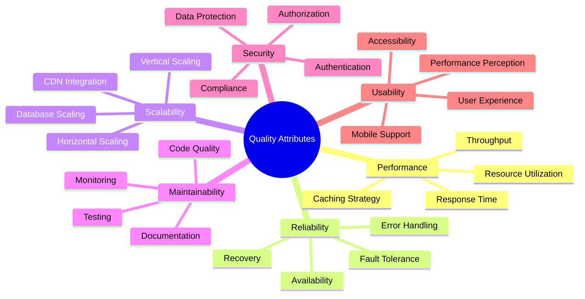

# Quality Attributes

## Overview

The SaaS Starter Kit is designed with **enterprise-grade quality attributes** including performance, reliability, scalability, maintainability, and security. This document outlines the quality attribute requirements, implementation strategies, and monitoring approaches to ensure the system meets production standards.

## Quality Attribute Framework



## Performance Characteristics

### Response Time Requirements

| Operation Type | Target Response Time | Maximum Acceptable |
|---------------|---------------------|-------------------|
| Page Load (First Paint) | < 1.5 seconds | < 3 seconds |
| API Calls (CRUD) | < 500ms | < 2 seconds |
| Database Queries | < 100ms | < 500ms |
| Authentication | < 1 second | < 3 seconds |
| File Uploads | < 5 seconds | < 15 seconds |
| Report Generation | < 10 seconds | < 30 seconds |

### Performance Implementation

#### Frontend Performance

```typescript
// pages/_app.tsx - Performance optimizations
import { Suspense } from 'react';
import dynamic from 'next/dynamic';
import { SWRConfig } from 'swr';

// Dynamic imports for code splitting
const AdminPanel = dynamic(() => import('@/components/admin/AdminPanel'), {
  suspense: true
});

// SWR configuration for optimal caching
const swrConfig = {
  dedupingInterval: 2000, // Dedupe requests within 2 seconds
  focusThrottleInterval: 5000, // Throttle revalidation on focus
  errorRetryCount: 3,
  errorRetryInterval: 5000,
  cache: new Map(), // Custom cache implementation
  fallback: {
    // Prefetched data
  }
};

export default function App({ Component, pageProps }: AppProps) {
  return (
    <SWRConfig value={swrConfig}>
      <Suspense fallback={<LoadingSpinner />}>
        <Component {...pageProps} />
      </Suspense>
    </SWRConfig>
  );
}
```

#### API Performance Optimization

```typescript
// lib/performance.ts
import { NextApiRequest, NextApiResponse } from 'next';
import { performance } from 'perf_hooks';

interface PerformanceMetrics {
  requestDuration: number;
  databaseTime: number;
  externalApiTime: number;
  memoryUsage: NodeJS.MemoryUsage;
}

export function withPerformanceMonitoring(handler: Function) {
  return async (req: NextApiRequest, res: NextApiResponse) => {
    const startTime = performance.now();
    const startMemory = process.memoryUsage();
    
    let databaseTime = 0;
    let externalApiTime = 0;

    // Monkey patch prisma for database timing
    const originalQuery = prisma.$queryRaw;
    prisma.$queryRaw = new Proxy(originalQuery, {
      apply: async (target, thisArg, args) => {
        const dbStart = performance.now();
        const result = await target.apply(thisArg, args);
        databaseTime += performance.now() - dbStart;
        return result;
      }
    });

    try {
      await handler(req, res);
    } finally {
      const endTime = performance.now();
      const endMemory = process.memoryUsage();
      
      const metrics: PerformanceMetrics = {
        requestDuration: endTime - startTime,
        databaseTime,
        externalApiTime,
        memoryUsage: {
          rss: endMemory.rss - startMemory.rss,
          heapUsed: endMemory.heapUsed - startMemory.heapUsed,
          heapTotal: endMemory.heapTotal - startMemory.heapTotal,
          external: endMemory.external - startMemory.external,
          arrayBuffers: endMemory.arrayBuffers - startMemory.arrayBuffers
        }
      };

      // Log slow requests
      if (metrics.requestDuration > 1000) {
        console.warn('Slow API request detected', {
          path: req.url,
          method: req.method,
          metrics
        });
      }

      // Send metrics to monitoring service
      await sendMetrics(req.url!, metrics);
    }
  };
}

async function sendMetrics(endpoint: string, metrics: PerformanceMetrics) {
  if (process.env.METRICS_ENDPOINT) {
    try {
      await fetch(process.env.METRICS_ENDPOINT, {
        method: 'POST',
        headers: { 'Content-Type': 'application/json' },
        body: JSON.stringify({
          endpoint,
          timestamp: new Date().toISOString(),
          ...metrics
        })
      });
    } catch (error) {
      console.error('Failed to send metrics:', error);
    }
  }
}
```

#### Database Performance

```typescript
// lib/database-optimization.ts
import { PrismaClient } from '@prisma/client';

// Connection pool optimization
export const prisma = new PrismaClient({
  log: [
    { level: 'query', emit: 'event' },
    { level: 'info', emit: 'stdout' },
    { level: 'warn', emit: 'stdout' },
    { level: 'error', emit: 'stdout' }
  ],
  datasources: {
    db: {
      url: process.env.DATABASE_URL
    }
  }
});

// Query performance monitoring
prisma.$on('query', (e) => {
  if (e.duration > 1000) {
    console.warn('Slow database query', {
      query: e.query,
      params: e.params,
      duration: `${e.duration}ms`
    });
  }
});

// Optimized query patterns
export class TeamRepository {
  static async findTeamWithMembers(slug: string) {
    return await prisma.team.findUnique({
      where: { slug },
      include: {
        members: {
          include: {
            user: {
              select: {
                id: true,
                name: true,
                email: true,
                image: true
              }
            }
          },
          orderBy: { createdAt: 'asc' }
        },
        _count: {
          select: {
            apiKeys: true,
            webhooks: true
          }
        }
      }
    });
  }

  static async findUserTeams(userId: string) {
    return await prisma.teamMember.findMany({
      where: { userId },
      include: {
        team: {
          select: {
            id: true,
            name: true,
            slug: true,
            features: true
          }
        }
      },
      orderBy: {
        team: { name: 'asc' }
      }
    });
  }
}

// Database indexing strategy
export const DATABASE_INDEXES = `
-- Performance-critical indexes
CREATE INDEX CONCURRENTLY IF NOT EXISTS idx_team_members_user_team 
ON team_members(user_id, team_id);

CREATE INDEX CONCURRENTLY IF NOT EXISTS idx_teams_slug 
ON teams(slug) WHERE slug IS NOT NULL;

CREATE INDEX CONCURRENTLY IF NOT EXISTS idx_api_keys_team_active 
ON api_keys(team_id, expires_at) 
WHERE expires_at IS NULL OR expires_at > NOW();

CREATE INDEX CONCURRENTLY IF NOT EXISTS idx_audit_logs_team_time 
ON audit_logs(team_id, created_at DESC);

-- Partial indexes for common queries
CREATE INDEX CONCURRENTLY IF NOT EXISTS idx_users_verified_email 
ON users(email) WHERE email_verified IS NOT NULL;

CREATE INDEX CONCURRENTLY IF NOT EXISTS idx_sessions_active 
ON sessions(user_id, expires) WHERE expires > NOW();
`;
```

### Caching Strategy

#### Multi-Layer Caching

```typescript
// lib/cache.ts
import { Redis } from 'ioredis';

const redis = new Redis(process.env.REDIS_URL!);

interface CacheOptions {
  ttl?: number; // Time to live in seconds
  tags?: string[]; // Cache tags for invalidation
}

export class CacheManager {
  private static instance: CacheManager;
  
  static getInstance(): CacheManager {
    if (!this.instance) {
      this.instance = new CacheManager();
    }
    return this.instance;
  }

  async get<T>(key: string): Promise<T | null> {
    try {
      const value = await redis.get(key);
      return value ? JSON.parse(value) : null;
    } catch (error) {
      console.error('Cache get error:', error);
      return null;
    }
  }

  async set<T>(key: string, value: T, options: CacheOptions = {}): Promise<void> {
    try {
      const serialized = JSON.stringify(value);
      
      if (options.ttl) {
        await redis.setex(key, options.ttl, serialized);
      } else {
        await redis.set(key, serialized);
      }

      // Store cache tags for invalidation
      if (options.tags) {
        for (const tag of options.tags) {
          await redis.sadd(`cache_tag:${tag}`, key);
        }
      }
    } catch (error) {
      console.error('Cache set error:', error);
    }
  }

  async invalidateByTag(tag: string): Promise<void> {
    try {
      const keys = await redis.smembers(`cache_tag:${tag}`);
      if (keys.length > 0) {
        await redis.del(...keys);
        await redis.del(`cache_tag:${tag}`);
      }
    } catch (error) {
      console.error('Cache invalidation error:', error);
    }
  }

  async invalidate(key: string): Promise<void> {
    try {
      await redis.del(key);
    } catch (error) {
      console.error('Cache invalidation error:', error);
    }
  }
}

// Cached API wrapper
export function withCache<T>(
  cacheKey: string,
  fetcher: () => Promise<T>,
  options: CacheOptions = {}
): Promise<T> {
  return async function (): Promise<T> {
    const cache = CacheManager.getInstance();
    
    // Try to get from cache first
    const cached = await cache.get<T>(cacheKey);
    if (cached !== null) {
      return cached;
    }

    // Fetch fresh data
    const data = await fetcher();
    
    // Store in cache
    await cache.set(cacheKey, data, {
      ttl: options.ttl || 300, // Default 5 minutes
      tags: options.tags
    });

    return data;
  };
}

// Usage example
export async function getTeamWithCache(slug: string) {
  return await withCache(
    `team:${slug}`,
    () => TeamRepository.findTeamWithMembers(slug),
    {
      ttl: 300, // 5 minutes
      tags: [`team:${slug}`, 'teams']
    }
  )();
}
```

## Reliability Architecture

### Availability Requirements

| Service Level | Target Uptime | Downtime/Year | Downtime/Month |
|--------------|---------------|---------------|----------------|
| Production | 99.9% | 8.77 hours | 43.83 minutes |
| Enterprise | 99.95% | 4.38 hours | 21.91 minutes |
| Critical | 99.99% | 52.6 minutes | 4.38 minutes |

### Error Handling Strategy

```typescript
// lib/error-handling.ts
export class AppError extends Error {
  constructor(
    message: string,
    public statusCode: number = 500,
    public code?: string,
    public isOperational: boolean = true
  ) {
    super(message);
    this.name = 'AppError';
    Error.captureStackTrace(this, this.constructor);
  }
}

export class ValidationError extends AppError {
  constructor(message: string, field?: string) {
    super(message, 400, 'VALIDATION_ERROR');
    this.name = 'ValidationError';
  }
}

export class NotFoundError extends AppError {
  constructor(resource: string = 'Resource') {
    super(`${resource} not found`, 404, 'NOT_FOUND');
    this.name = 'NotFoundError';
  }
}

export class AuthorizationError extends AppError {
  constructor(message: string = 'Insufficient permissions') {
    super(message, 403, 'AUTHORIZATION_ERROR');
    this.name = 'AuthorizationError';
  }
}

// Global error handler
export function handleGlobalError(error: Error, req: NextApiRequest, res: NextApiResponse) {
  // Log error with context
  console.error('API Error:', {
    error: error.message,
    stack: error.stack,
    url: req.url,
    method: req.method,
    userAgent: req.headers['user-agent'],
    timestamp: new Date().toISOString()
  });

  // Send to monitoring service
  if (process.env.SENTRY_DSN) {
    // Sentry.captureException(error);
  }

  // Handle known errors
  if (error instanceof AppError) {
    return res.status(error.statusCode).json({
      error: error.message,
      code: error.code
    });
  }

  // Handle Prisma errors
  if (error.code === 'P2002') {
    return res.status(409).json({
      error: 'Unique constraint violation',
      code: 'DUPLICATE_ENTRY'
    });
  }

  // Default error response
  res.status(500).json({
    error: 'Internal server error',
    code: 'INTERNAL_ERROR'
  });
}
```

### Circuit Breaker Pattern

```typescript
// lib/circuit-breaker.ts
export enum CircuitState {
  CLOSED = 'CLOSED',
  OPEN = 'OPEN',
  HALF_OPEN = 'HALF_OPEN'
}

interface CircuitBreakerConfig {
  failureThreshold: number;
  resetTimeout: number;
  monitoringPeriod: number;
}

export class CircuitBreaker {
  private state: CircuitState = CircuitState.CLOSED;
  private failures: number = 0;
  private lastFailureTime: number = 0;
  private nextAttempt: number = 0;

  constructor(private config: CircuitBreakerConfig) {}

  async execute<T>(operation: () => Promise<T>): Promise<T> {
    if (this.state === CircuitState.OPEN) {
      if (Date.now() < this.nextAttempt) {
        throw new Error('Circuit breaker is OPEN');
      }
      this.state = CircuitState.HALF_OPEN;
    }

    try {
      const result = await operation();
      this.onSuccess();
      return result;
    } catch (error) {
      this.onFailure();
      throw error;
    }
  }

  private onSuccess() {
    this.failures = 0;
    this.state = CircuitState.CLOSED;
  }

  private onFailure() {
    this.failures++;
    this.lastFailureTime = Date.now();

    if (this.failures >= this.config.failureThreshold) {
      this.state = CircuitState.OPEN;
      this.nextAttempt = Date.now() + this.config.resetTimeout;
    }
  }

  getState(): CircuitState {
    return this.state;
  }
}

// External service wrapper with circuit breaker
export class ExternalServiceClient {
  private circuitBreaker: CircuitBreaker;

  constructor(private baseUrl: string) {
    this.circuitBreaker = new CircuitBreaker({
      failureThreshold: 5,
      resetTimeout: 60000, // 1 minute
      monitoringPeriod: 30000 // 30 seconds
    });
  }

  async makeRequest<T>(endpoint: string, options: RequestInit = {}): Promise<T> {
    return await this.circuitBreaker.execute(async () => {
      const response = await fetch(`${this.baseUrl}${endpoint}`, {
        timeout: 10000, // 10 second timeout
        ...options
      });

      if (!response.ok) {
        throw new Error(`HTTP ${response.status}: ${response.statusText}`);
      }

      return await response.json();
    });
  }
}
```

### Health Monitoring

```typescript
// lib/health-check.ts
export interface HealthCheckResult {
  status: 'healthy' | 'unhealthy' | 'degraded';
  checks: Record<string, {
    status: 'pass' | 'fail' | 'warn';
    time: string;
    output?: string;
  }>;
  version: string;
  uptime: number;
  timestamp: string;
}

export class HealthChecker {
  async performHealthCheck(): Promise<HealthCheckResult> {
    const checks: HealthCheckResult['checks'] = {};
    let overallStatus: HealthCheckResult['status'] = 'healthy';

    // Database health check
    try {
      const start = Date.now();
      await prisma.$queryRaw`SELECT 1`;
      checks.database = {
        status: 'pass',
        time: `${Date.now() - start}ms`
      };
    } catch (error) {
      checks.database = {
        status: 'fail',
        time: '0ms',
        output: error.message
      };
      overallStatus = 'unhealthy';
    }

    // Redis health check
    try {
      const start = Date.now();
      await redis.ping();
      checks.redis = {
        status: 'pass',
        time: `${Date.now() - start}ms`
      };
    } catch (error) {
      checks.redis = {
        status: 'warn',
        time: '0ms',
        output: error.message
      };
      if (overallStatus === 'healthy') {
        overallStatus = 'degraded';
      }
    }

    // External services health check
    const externalServices = [
      { name: 'stripe', url: 'https://api.stripe.com/v1' },
      { name: 'sentry', url: process.env.SENTRY_DSN }
    ];

    for (const service of externalServices) {
      if (!service.url) continue;
      
      try {
        const start = Date.now();
        const response = await fetch(service.url, { 
          method: 'HEAD',
          timeout: 5000 
        });
        
        checks[service.name] = {
          status: response.ok ? 'pass' : 'warn',
          time: `${Date.now() - start}ms`
        };
      } catch (error) {
        checks[service.name] = {
          status: 'warn',
          time: '0ms',
          output: error.message
        };
        if (overallStatus === 'healthy') {
          overallStatus = 'degraded';
        }
      }
    }

    return {
      status: overallStatus,
      checks,
      version: process.env.npm_package_version || 'unknown',
      uptime: process.uptime(),
      timestamp: new Date().toISOString()
    };
  }
}

// Health check API endpoint
// pages/api/health.ts
export default async function handler(req: NextApiRequest, res: NextApiResponse) {
  const healthChecker = new HealthChecker();
  const result = await healthChecker.performHealthCheck();
  
  const statusCode = result.status === 'healthy' ? 200 : 
                    result.status === 'degraded' ? 200 : 503;
  
  res.status(statusCode).json(result);
}
```

## Scalability Design

### Horizontal Scaling Strategy

```typescript
// lib/scaling.ts
export interface ScalingMetrics {
  cpuUsage: number;
  memoryUsage: number;
  activeConnections: number;
  requestsPerSecond: number;
  averageResponseTime: number;
}

export class AutoScaler {
  private static instance: AutoScaler;
  
  static getInstance(): AutoScaler {
    if (!this.instance) {
      this.instance = new AutoScaler();
    }
    return this.instance;
  }

  async getMetrics(): Promise<ScalingMetrics> {
    const memUsage = process.memoryUsage();
    
    return {
      cpuUsage: await this.getCpuUsage(),
      memoryUsage: (memUsage.heapUsed / memUsage.heapTotal) * 100,
      activeConnections: await this.getActiveConnections(),
      requestsPerSecond: await this.getRequestRate(),
      averageResponseTime: await this.getAverageResponseTime()
    };
  }

  async shouldScale(metrics: ScalingMetrics): Promise<{
    scale: boolean;
    direction: 'up' | 'down';
    reason: string;
  }> {
    // Scale up conditions
    if (metrics.cpuUsage > 80) {
      return { scale: true, direction: 'up', reason: 'High CPU usage' };
    }
    
    if (metrics.memoryUsage > 85) {
      return { scale: true, direction: 'up', reason: 'High memory usage' };
    }
    
    if (metrics.averageResponseTime > 2000) {
      return { scale: true, direction: 'up', reason: 'High response time' };
    }

    // Scale down conditions
    if (metrics.cpuUsage < 20 && metrics.memoryUsage < 30) {
      return { scale: true, direction: 'down', reason: 'Low resource usage' };
    }

    return { scale: false, direction: 'up', reason: 'Metrics within normal range' };
  }

  private async getCpuUsage(): Promise<number> {
    // Implementation depends on environment
    // In Kubernetes, this would come from metrics server
    return 0;
  }

  private async getActiveConnections(): Promise<number> {
    // Get from database connection pool or load balancer
    return 0;
  }

  private async getRequestRate(): Promise<number> {
    // Calculate from metrics store
    return 0;
  }

  private async getAverageResponseTime(): Promise<number> {
    // Calculate from metrics store
    return 0;
  }
}
```

### Database Scaling

```typescript
// lib/database-scaling.ts
export class DatabaseScaler {
  private readReplicas: string[] = [];
  private writeConnection: string;

  constructor() {
    this.writeConnection = process.env.DATABASE_URL!;
    this.readReplicas = process.env.DATABASE_READ_REPLICAS?.split(',') || [];
  }

  getReadConnection(): string {
    if (this.readReplicas.length === 0) {
      return this.writeConnection;
    }
    
    // Round-robin selection
    const index = Math.floor(Math.random() * this.readReplicas.length);
    return this.readReplicas[index];
  }

  getWriteConnection(): string {
    return this.writeConnection;
  }

  async executeReadQuery<T>(query: () => Promise<T>): Promise<T> {
    // Use read replica for read operations
    const originalUrl = process.env.DATABASE_URL;
    process.env.DATABASE_URL = this.getReadConnection();
    
    try {
      return await query();
    } finally {
      process.env.DATABASE_URL = originalUrl;
    }
  }

  async executeWriteQuery<T>(query: () => Promise<T>): Promise<T> {
    // Always use primary for write operations
    return await query();
  }
}

// Usage in repositories
export class OptimizedTeamRepository {
  private dbScaler = new DatabaseScaler();

  async findTeam(slug: string) {
    return await this.dbScaler.executeReadQuery(() =>
      prisma.team.findUnique({ where: { slug } })
    );
  }

  async createTeam(data: CreateTeamData) {
    return await this.dbScaler.executeWriteQuery(() =>
      prisma.team.create({ data })
    );
  }
}
```

## Maintainability

### Code Quality Metrics

```typescript
// tools/code-quality.ts
export interface QualityMetrics {
  testCoverage: number;
  cyclomaticComplexity: number;
  duplicatedLines: number;
  maintainabilityIndex: number;
  technicalDebt: string;
}

export class CodeQualityAnalyzer {
  async analyzeProject(): Promise<QualityMetrics> {
    const coverage = await this.getTestCoverage();
    const complexity = await this.getCyclomaticComplexity();
    const duplication = await this.getDuplication();
    
    return {
      testCoverage: coverage,
      cyclomaticComplexity: complexity,
      duplicatedLines: duplication,
      maintainabilityIndex: this.calculateMaintainabilityIndex(coverage, complexity, duplication),
      technicalDebt: this.assessTechnicalDebt()
    };
  }

  private async getTestCoverage(): Promise<number> {
    // Parse coverage reports
    return 85; // Example value
  }

  private async getCyclomaticComplexity(): Promise<number> {
    // Analyze code complexity
    return 15; // Example value
  }

  private async getDuplication(): Promise<number> {
    // Detect code duplication
    return 3; // Example percentage
  }

  private calculateMaintainabilityIndex(
    coverage: number,
    complexity: number,
    duplication: number
  ): number {
    // Microsoft's maintainability index formula (simplified)
    return Math.max(0, (171 - 5.2 * Math.log(complexity) - 0.23 * coverage - 16.2 * Math.log(duplication + 1)) * 100 / 171);
  }

  private assessTechnicalDebt(): string {
    // Analyze various debt indicators
    return 'Low'; // Example assessment
  }
}
```

### Monitoring and Observability

```typescript
// lib/observability.ts
import { metrics, trace } from '@opentelemetry/api';

const meter = metrics.getMeter('saas-starter-kit');
const tracer = trace.getTracer('saas-starter-kit');

// Custom metrics
export const requestCounter = meter.createCounter('http_requests_total', {
  description: 'Total number of HTTP requests'
});

export const requestDuration = meter.createHistogram('http_request_duration_ms', {
  description: 'Duration of HTTP requests in milliseconds'
});

export const activeUsers = meter.createUpDownCounter('active_users', {
  description: 'Number of active users'
});

export const databaseConnections = meter.createUpDownCounter('database_connections', {
  description: 'Number of active database connections'
});

// Distributed tracing
export function withTracing<T>(
  operationName: string,
  operation: () => Promise<T>
): Promise<T> {
  return tracer.startActiveSpan(operationName, async (span) => {
    try {
      const result = await operation();
      span.setStatus({ code: trace.SpanStatusCode.OK });
      return result;
    } catch (error) {
      span.setStatus({
        code: trace.SpanStatusCode.ERROR,
        message: error.message
      });
      throw error;
    } finally {
      span.end();
    }
  });
}

// Performance monitoring middleware
export function withMetrics(handler: Function) {
  return async (req: NextApiRequest, res: NextApiResponse) => {
    const startTime = Date.now();
    
    // Increment request counter
    requestCounter.add(1, {
      method: req.method!,
      route: req.url!
    });

    try {
      await handler(req, res);
    } finally {
      // Record request duration
      const duration = Date.now() - startTime;
      requestDuration.record(duration, {
        method: req.method!,
        route: req.url!,
        status_code: res.statusCode.toString()
      });
    }
  };
}

// Business metrics
export class BusinessMetrics {
  static async trackUserSignup(userId: string, teamId: string) {
    const signupCounter = meter.createCounter('user_signups_total');
    signupCounter.add(1, {
      team_id: teamId
    });
  }

  static async trackFeatureUsage(feature: string, teamId: string) {
    const featureCounter = meter.createCounter('feature_usage_total');
    featureCounter.add(1, {
      feature,
      team_id: teamId
    });
  }

  static async trackBillingEvent(event: string, amount: number, teamId: string) {
    const billingCounter = meter.createCounter('billing_events_total');
    const revenueGauge = meter.createUpDownCounter('revenue_total');
    
    billingCounter.add(1, {
      event,
      team_id: teamId
    });
    
    if (event === 'payment_succeeded') {
      revenueGauge.add(amount, {
        team_id: teamId
      });
    }
  }
}
```

## Testing Strategy

### Test Pyramid Implementation

```typescript
// tests/unit/services/team.test.ts
import { TeamService } from '@/lib/services/TeamService';
import { prismaMock } from '@/tests/mocks/prisma';

describe('TeamService', () => {
  beforeEach(() => {
    jest.clearAllMocks();
  });

  describe('createTeam', () => {
    it('should create a new team with owner membership', async () => {
      const teamData = {
        name: 'Test Team',
        slug: 'test-team',
        ownerId: 'user-123'
      };

      prismaMock.team.create.mockResolvedValue({
        id: 'team-123',
        ...teamData,
        members: [{
          id: 'member-123',
          userId: 'user-123',
          teamId: 'team-123',
          role: 'OWNER'
        }]
      });

      const result = await TeamService.createTeam(teamData);

      expect(result.id).toBe('team-123');
      expect(result.members[0].role).toBe('OWNER');
      expect(prismaMock.team.create).toHaveBeenCalledWith({
        data: expect.objectContaining({
          name: teamData.name,
          slug: teamData.slug
        })
      });
    });
  });
});
```

### Performance Testing

```typescript
// tests/performance/load-test.ts
import autocannon from 'autocannon';

async function runLoadTest() {
  const result = await autocannon({
    url: 'http://localhost:4002',
    connections: 100,
    duration: 30, // 30 seconds
    headers: {
      'Authorization': 'Bearer test-api-key'
    },
    requests: [
      {
        method: 'GET',
        path: '/api/teams/test-team'
      },
      {
        method: 'GET',
        path: '/api/teams/test-team/members'
      },
      {
        method: 'POST',
        path: '/api/teams/test-team/api-keys',
        body: JSON.stringify({ name: 'Load Test Key' }),
        headers: {
          'Content-Type': 'application/json'
        }
      }
    ]
  });

  console.log('Load test results:', result);
  
  // Assert performance requirements
  expect(result.latency.average).toBeLessThan(500); // < 500ms average
  expect(result.latency.p99).toBeLessThan(2000); // < 2s p99
  expect(result.errors).toBe(0); // No errors
}
```

This comprehensive quality attributes documentation ensures the SaaS Starter Kit meets enterprise-grade standards for performance, reliability, scalability, and maintainability.