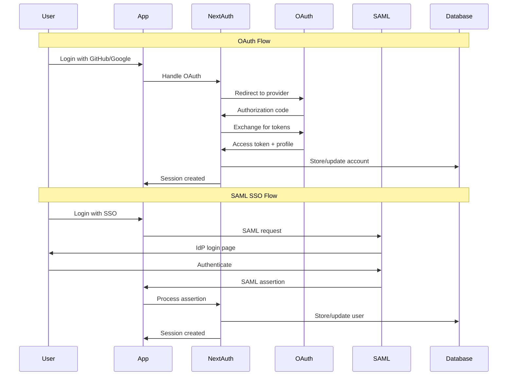
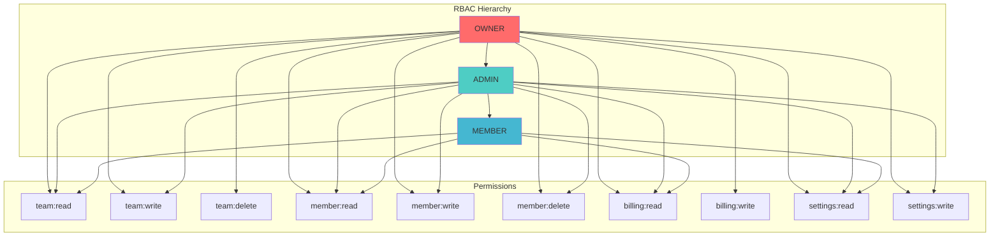

# Security Architecture

## Overview

The SaaS Starter Kit implements a **comprehensive security architecture** with defense-in-depth principles, supporting enterprise security requirements including SSO, audit logging, data protection, and compliance frameworks. The security model emphasizes zero-trust principles with multiple layers of protection.

## Security Framework

```mermaid
graph TD
    subgraph "Application Security Layers"
        A[Network Security<br/>TLS, Headers, DDoS]
        B[Authentication<br/>Multi-provider, MFA]
        C[Authorization<br/>RBAC, Team Isolation]
        D[Data Security<br/>Encryption, Validation]
        E[Audit & Monitoring<br/>Logging, Alerting]
    end
    
    subgraph "Infrastructure Security"
        F[Container Security<br/>Image Scanning, Runtime]
        G[Database Security<br/>Encryption, Access Control]
        H[API Security<br/>Rate Limiting, Validation]
    end
    
    subgraph "Compliance & Governance"
        I[Data Protection<br/>GDPR, Privacy]
        J[Audit Trails<br/>SOC2, Compliance]
        K[Incident Response<br/>Monitoring, Alerting]
    end
    
    A --> B --> C --> D --> E
    F --> G --> H
    I --> J --> K
    
    style A fill:#ffebee
    style B fill:#e8f5e8
    style C fill:#e3f2fd
    style D fill:#fff3e0
```



## Authentication Architecture

### Multi-Provider Authentication



#### Authentication Providers Configuration

```typescript
// lib/nextAuth.ts
import { NextAuthOptions } from 'next-auth';
import { PrismaAdapter } from '@next-auth/prisma-adapter';
import GitHubProvider from 'next-auth/providers/github';
import GoogleProvider from 'next-auth/providers/google';
import EmailProvider from 'next-auth/providers/email';
import CredentialsProvider from 'next-auth/providers/credentials';
import { SAMLProvider } from './saml-provider';
import { prisma } from './prisma';
import { compare } from 'bcryptjs';

export const authOptions: NextAuthOptions = {
  adapter: PrismaAdapter(prisma),
  providers: [
    // OAuth Providers
    GitHubProvider({
      clientId: process.env.GITHUB_CLIENT_ID!,
      clientSecret: process.env.GITHUB_CLIENT_SECRET!,
      authorization: {
        params: {
          scope: 'read:user user:email'
        }
      }
    }),
    
    GoogleProvider({
      clientId: process.env.GOOGLE_CLIENT_ID!,
      clientSecret: process.env.GOOGLE_CLIENT_SECRET!,
      authorization: {
        params: {
          scope: 'openid email profile',
          prompt: 'consent'
        }
      }
    }),
    
    // Email Magic Links
    EmailProvider({
      server: {
        host: process.env.SMTP_HOST,
        port: parseInt(process.env.SMTP_PORT || '587'),
        auth: {
          user: process.env.SMTP_USER,
          pass: process.env.SMTP_PASSWORD
        }
      },
      from: process.env.EMAIL_FROM,
      maxAge: 24 * 60 * 60 // 24 hours
    }),
    
    // Credentials (Email/Password)
    CredentialsProvider({
      name: 'credentials',
      credentials: {
        email: { label: 'Email', type: 'email' },
        password: { label: 'Password', type: 'password' }
      },
      async authorize(credentials) {
        if (!credentials?.email || !credentials?.password) {
          throw new Error('Missing credentials');
        }

        const user = await prisma.user.findUnique({
          where: { email: credentials.email }
        });

        if (!user || !user.password) {
          throw new Error('Invalid credentials');
        }

        // Check account lockout
        if (user.lockedAt && user.lockedAt > new Date(Date.now() - 30 * 60 * 1000)) {
          throw new Error('Account temporarily locked');
        }

        const isValidPassword = await compare(credentials.password, user.password);
        
        if (!isValidPassword) {
          // Increment failed attempts
          await prisma.user.update({
            where: { id: user.id },
            data: {
              loginAttempts: { increment: 1 },
              ...(user.loginAttempts >= 4 && { lockedAt: new Date() })
            }
          });
          throw new Error('Invalid credentials');
        }

        // Reset failed attempts on successful login
        if (user.loginAttempts > 0) {
          await prisma.user.update({
            where: { id: user.id },
            data: {
              loginAttempts: 0,
              lockedAt: null
            }
          });
        }

        return {
          id: user.id,
          email: user.email,
          name: user.name,
          image: user.image
        };
      }
    }),
    
    // SAML SSO Provider
    SAMLProvider({
      name: 'saml',
      server: {
        providerId: 'saml',
        redirectUrl: process.env.NEXTAUTH_URL + '/api/oauth/saml',
        entryPoint: process.env.SAML_ENTRY_POINT,
        issuer: process.env.SAML_ISSUER,
        cert: process.env.SAML_CERT
      }
    })
  ],
  
  session: {
    strategy: 'database', // Use database sessions for multi-device support
    maxAge: 30 * 24 * 60 * 60, // 30 days
    updateAge: 24 * 60 * 60 // Update session every 24 hours
  },
  
  pages: {
    signIn: '/auth/signin',
    signUp: '/auth/signup',
    error: '/auth/error',
    verifyRequest: '/auth/verify-request'
  },
  
  callbacks: {
    async signIn({ user, account, profile, email, credentials }) {
      // Additional sign-in validation
      if (account?.provider === 'email') {
        return true; // Allow email verification
      }
      
      // Check if email is verified for OAuth providers
      if (account?.provider !== 'credentials' && !email?.verificationRequest) {
        const existingUser = await prisma.user.findUnique({
          where: { email: user.email! }
        });
        
        if (existingUser && !existingUser.emailVerified) {
          // Mark email as verified for OAuth sign-ins
          await prisma.user.update({
            where: { email: user.email! },
            data: { emailVerified: new Date() }
          });
        }
      }
      
      return true;
    },
    
    async session({ session, user, token }) {
      if (session?.user) {
        session.user.id = user.id;
        
        // Add user teams to session
        const userTeams = await prisma.teamMember.findMany({
          where: { userId: user.id },
          include: {
            team: {
              select: {
                id: true,
                name: true,
                slug: true
              }
            }
          }
        });
        
        session.user.teams = userTeams.map(tm => ({
          id: tm.team.id,
          name: tm.team.name,
          slug: tm.team.slug,
          role: tm.role
        }));
      }
      
      return session;
    }
  },
  
  events: {
    async signIn({ user, account, profile, isNewUser }) {
      // Log successful sign-ins
      console.log(`User ${user.email} signed in via ${account?.provider}`);
      
      // Track analytics
      if (process.env.MIXPANEL_TOKEN) {
        // Track sign-in event
      }
    },
    
    async signOut({ token }) {
      console.log(`User signed out`);
    }
  }
};
```

### Account Security Features

#### Password Security
```typescript
// lib/password-security.ts
import { hash, compare } from 'bcryptjs';
import { z } from 'zod';

// Password strength validation
export const passwordSchema = z.string()
  .min(8, 'Password must be at least 8 characters')
  .regex(/^(?=.*[a-z])/, 'Password must contain at least one lowercase letter')
  .regex(/^(?=.*[A-Z])/, 'Password must contain at least one uppercase letter')
  .regex(/^(?=.*\d)/, 'Password must contain at least one number')
  .regex(/^(?=.*[@$!%*?&])/, 'Password must contain at least one special character');

export async function hashPassword(password: string): Promise<string> {
  // Validate password strength
  passwordSchema.parse(password);
  
  // Hash with bcrypt (cost factor 12)
  return await hash(password, 12);
}

export async function verifyPassword(password: string, hashedPassword: string): Promise<boolean> {
  return await compare(password, hashedPassword);
}

// Account lockout configuration
export const LOCKOUT_CONFIG = {
  maxAttempts: 5,
  lockoutDuration: 30 * 60 * 1000, // 30 minutes
  resetPeriod: 24 * 60 * 60 * 1000 // 24 hours
};

export async function handleFailedLogin(userId: string) {
  const user = await prisma.user.findUnique({
    where: { id: userId },
    select: { loginAttempts: true, lockedAt: true }
  });

  if (!user) return;

  const attempts = user.loginAttempts + 1;
  const shouldLock = attempts >= LOCKOUT_CONFIG.maxAttempts;

  await prisma.user.update({
    where: { id: userId },
    data: {
      loginAttempts: attempts,
      ...(shouldLock && { lockedAt: new Date() })
    }
  });

  if (shouldLock) {
    // Send security alert email
    await sendSecurityAlert(userId, 'account_locked');
  }
}
```

#### Multi-Factor Authentication (MFA)
```typescript
// lib/mfa.ts
import { authenticator } from 'otplib';
import QRCode from 'qrcode';

export async function enableMFA(userId: string, teamSlug: string) {
  const user = await prisma.user.findUnique({
    where: { id: userId },
    select: { email: true, name: true }
  });

  if (!user) throw new Error('User not found');

  // Generate secret
  const secret = authenticator.generateSecret();
  
  // Create service name
  const serviceName = `SaaS Kit (${teamSlug})`;
  const otpUrl = authenticator.keyuri(user.email, serviceName, secret);
  
  // Generate QR code
  const qrCode = await QRCode.toDataURL(otpUrl);
  
  // Store secret (encrypted)
  await prisma.user.update({
    where: { id: userId },
    data: {
      mfaSecret: encrypt(secret),
      mfaEnabled: false // Not enabled until verified
    }
  });

  return {
    secret,
    qrCode,
    backupCodes: generateBackupCodes()
  };
}

export function verifyMFAToken(secret: string, token: string): boolean {
  return authenticator.verify({ token, secret });
}

function generateBackupCodes(): string[] {
  return Array.from({ length: 10 }, () => 
    Math.random().toString(36).substring(2, 10).toUpperCase()
  );
}
```

## Authorization Architecture

### Role-Based Access Control (RBAC)



#### Permission System Implementation
```typescript
// lib/permissions.ts
export enum Permission {
  // Team permissions
  TEAM_READ = 'team:read',
  TEAM_WRITE = 'team:write',
  TEAM_DELETE = 'team:delete',
  
  // Member permissions
  MEMBER_READ = 'member:read',
  MEMBER_WRITE = 'member:write',
  MEMBER_DELETE = 'member:delete',
  
  // Billing permissions
  BILLING_READ = 'billing:read',
  BILLING_WRITE = 'billing:write',
  
  // Settings permissions
  SETTINGS_READ = 'settings:read',
  SETTINGS_WRITE = 'settings:write',
  
  // API permissions
  API_KEY_READ = 'api_key:read',
  API_KEY_WRITE = 'api_key:write',
  
  // Webhook permissions
  WEBHOOK_READ = 'webhook:read',
  WEBHOOK_WRITE = 'webhook:write'
}

export enum Role {
  OWNER = 'OWNER',
  ADMIN = 'ADMIN',
  MEMBER = 'MEMBER'
}

// Permission matrix
const ROLE_PERMISSIONS: Record<Role, Permission[]> = {
  [Role.OWNER]: [
    // Owners have all permissions
    ...Object.values(Permission)
  ],
  
  [Role.ADMIN]: [
    Permission.TEAM_READ,
    Permission.TEAM_WRITE,
    Permission.MEMBER_READ,
    Permission.MEMBER_WRITE,
    Permission.MEMBER_DELETE,
    Permission.BILLING_READ,
    Permission.SETTINGS_READ,
    Permission.SETTINGS_WRITE,
    Permission.API_KEY_READ,
    Permission.API_KEY_WRITE,
    Permission.WEBHOOK_READ,
    Permission.WEBHOOK_WRITE
  ],
  
  [Role.MEMBER]: [
    Permission.TEAM_READ,
    Permission.MEMBER_READ,
    Permission.BILLING_READ,
    Permission.SETTINGS_READ
  ]
};

export function hasPermission(role: Role, permission: Permission): boolean {
  return ROLE_PERMISSIONS[role].includes(permission);
}

export async function getUserRole(userId: string, teamSlug: string): Promise<Role | null> {
  const membership = await prisma.teamMember.findFirst({
    where: {
      userId,
      team: { slug: teamSlug }
    },
    select: { role: true }
  });

  return membership?.role as Role || null;
}

export async function checkPermission(
  userId: string,
  teamSlug: string,
  permission: Permission
): Promise<boolean> {
  const role = await getUserRole(userId, teamSlug);
  if (!role) return false;
  
  return hasPermission(role, permission);
}

export async function throwIfNotAllowed(
  userId: string,
  teamSlug: string,
  permission: Permission
): Promise<void> {
  const hasAccess = await checkPermission(userId, teamSlug, permission);
  if (!hasAccess) {
    throw new AuthorizationError(`Missing permission: ${permission}`);
  }
}
```

#### API Route Protection
```typescript
// middleware/auth.ts
import { NextApiRequest, NextApiResponse } from 'next';
import { getServerSession } from 'next-auth';
import { authOptions } from '@/lib/nextAuth';
import { Permission, checkPermission } from '@/lib/permissions';

type AuthenticatedHandler = (
  req: NextApiRequest,
  res: NextApiResponse,
  user: { id: string; email: string }
) => Promise<void>;

export function withAuth(handler: AuthenticatedHandler) {
  return async (req: NextApiRequest, res: NextApiResponse) => {
    const session = await getServerSession(req, res, authOptions);
    
    if (!session?.user) {
      return res.status(401).json({ error: 'Unauthorized' });
    }

    try {
      await handler(req, res, session.user);
    } catch (error) {
      console.error('API Error:', error);
      
      if (error instanceof AuthorizationError) {
        return res.status(403).json({ error: error.message });
      }
      
      return res.status(500).json({ error: 'Internal server error' });
    }
  };
}

export function withPermission(permission: Permission) {
  return function (handler: AuthenticatedHandler) {
    return withAuth(async (req, res, user) => {
      const { slug } = req.query as { slug: string };
      
      if (!slug) {
        return res.status(400).json({ error: 'Team slug required' });
      }

      const hasAccess = await checkPermission(user.id, slug, permission);
      if (!hasAccess) {
        return res.status(403).json({ 
          error: `Missing permission: ${permission}` 
        });
      }

      await handler(req, res, user);
    });
  };
}

// Usage example
export default withPermission(Permission.MEMBER_READ)(async (req, res, user) => {
  const { slug } = req.query as { slug: string };
  const members = await getTeamMembers(slug);
  res.json(members);
});
```

## Data Security

### Data Encryption

#### At Rest Encryption
```typescript
// lib/encryption.ts
import { createCipher, createDecipher, randomBytes } from 'crypto';

const ENCRYPTION_KEY = process.env.ENCRYPTION_KEY!;
const ALGORITHM = 'aes-256-gcm';

export function encrypt(text: string): { encrypted: string; iv: string; tag: string } {
  const iv = randomBytes(16);
  const cipher = createCipher(ALGORITHM, ENCRYPTION_KEY);
  
  let encrypted = cipher.update(text, 'utf8', 'hex');
  encrypted += cipher.final('hex');
  
  const tag = cipher.getAuthTag();
  
  return {
    encrypted,
    iv: iv.toString('hex'),
    tag: tag.toString('hex')
  };
}

export function decrypt(encrypted: string, iv: string, tag: string): string {
  const decipher = createDecipher(ALGORITHM, ENCRYPTION_KEY);
  decipher.setAuthTag(Buffer.from(tag, 'hex'));
  
  let decrypted = decipher.update(encrypted, 'hex', 'utf8');
  decrypted += decipher.final('utf8');
  
  return decrypted;
}

// Database field encryption for sensitive data
export async function encryptSensitiveField(value: string): Promise<string> {
  const { encrypted, iv, tag } = encrypt(value);
  return JSON.stringify({ encrypted, iv, tag });
}

export function decryptSensitiveField(encryptedValue: string): string {
  const { encrypted, iv, tag } = JSON.parse(encryptedValue);
  return decrypt(encrypted, iv, tag);
}
```

#### In Transit Security
```typescript
// middleware.ts - Security headers
import { NextRequest, NextResponse } from 'next/server';

export function middleware(request: NextRequest) {
  const response = NextResponse.next();

  // Security headers
  response.headers.set('X-Frame-Options', 'DENY');
  response.headers.set('X-Content-Type-Options', 'nosniff');
  response.headers.set('X-XSS-Protection', '1; mode=block');
  response.headers.set('Referrer-Policy', 'strict-origin-when-cross-origin');
  response.headers.set(
    'Strict-Transport-Security',
    'max-age=63072000; includeSubDomains; preload'
  );
  
  // Content Security Policy
  response.headers.set(
    'Content-Security-Policy',
    [
      "default-src 'self'",
      "script-src 'self' 'unsafe-inline' 'unsafe-eval' https://js.stripe.com",
      "style-src 'self' 'unsafe-inline' https://fonts.googleapis.com",
      "font-src 'self' https://fonts.gstatic.com",
      "img-src 'self' data: https:",
      "connect-src 'self' https://api.stripe.com https://*.sentry.io",
      "frame-src https://js.stripe.com"
    ].join('; ')
  );

  return response;
}

export const config = {
  matcher: [
    '/((?!api/webhooks|_next/static|_next/image|favicon.ico).*)',
  ],
};
```

### Input Validation and Sanitization

```typescript
// lib/validation.ts
import { z } from 'zod';
import DOMPurify from 'isomorphic-dompurify';

// Common validation schemas
export const emailSchema = z.string().email('Invalid email address');
export const passwordSchema = z.string()
  .min(8, 'Password must be at least 8 characters')
  .regex(/^(?=.*[a-z])(?=.*[A-Z])(?=.*\d)(?=.*[@$!%*?&])/, 
    'Password must contain uppercase, lowercase, number, and special character');

export const teamSlugSchema = z.string()
  .min(3, 'Slug must be at least 3 characters')
  .max(50, 'Slug must be less than 50 characters')
  .regex(/^[a-z0-9-]+$/, 'Slug can only contain lowercase letters, numbers, and hyphens');

// API input validation
export function validateApiInput<T>(schema: z.ZodSchema<T>, data: unknown): T {
  try {
    return schema.parse(data);
  } catch (error) {
    if (error instanceof z.ZodError) {
      throw new ValidationError(
        error.errors.map(e => `${e.path.join('.')}: ${e.message}`).join(', ')
      );
    }
    throw error;
  }
}

// HTML sanitization
export function sanitizeHtml(html: string): string {
  return DOMPurify.sanitize(html, {
    ALLOWED_TAGS: ['b', 'i', 'em', 'strong', 'a', 'p', 'br'],
    ALLOWED_ATTR: ['href']
  });
}

// SQL injection prevention (Prisma handles this, but for raw queries)
export function sanitizeSqlInput(input: string): string {
  return input.replace(/['";\\]/g, '\\$&');
}
```

## API Security

### Rate Limiting

```typescript
// lib/rate-limit.ts
import { NextApiRequest, NextApiResponse } from 'next';
import { Redis } from 'ioredis';

const redis = new Redis(process.env.REDIS_URL!);

interface RateLimitConfig {
  windowMs: number;  // Time window in milliseconds
  maxRequests: number;  // Max requests per window
  keyGenerator?: (req: NextApiRequest) => string;
}

const defaultConfig: RateLimitConfig = {
  windowMs: 15 * 60 * 1000, // 15 minutes
  maxRequests: 100
};

export function rateLimit(config: Partial<RateLimitConfig> = {}) {
  const { windowMs, maxRequests, keyGenerator } = { ...defaultConfig, ...config };

  return async (req: NextApiRequest, res: NextApiResponse, next: () => void) => {
    const key = keyGenerator ? keyGenerator(req) : getDefaultKey(req);
    const windowKey = `rate_limit:${key}:${Math.floor(Date.now() / windowMs)}`;

    try {
      const current = await redis.incr(windowKey);
      
      if (current === 1) {
        await redis.expire(windowKey, Math.ceil(windowMs / 1000));
      }

      res.setHeader('X-RateLimit-Limit', maxRequests);
      res.setHeader('X-RateLimit-Remaining', Math.max(0, maxRequests - current));
      res.setHeader('X-RateLimit-Reset', new Date(Date.now() + windowMs));

      if (current > maxRequests) {
        return res.status(429).json({
          error: 'Too many requests',
          retryAfter: Math.ceil(windowMs / 1000)
        });
      }

      next();
    } catch (error) {
      console.error('Rate limiting error:', error);
      next(); // Fail open
    }
  };
}

function getDefaultKey(req: NextApiRequest): string {
  const forwarded = req.headers['x-forwarded-for'];
  const ip = forwarded ? 
    (Array.isArray(forwarded) ? forwarded[0] : forwarded.split(',')[0]) :
    req.connection.remoteAddress;
  
  return `ip:${ip}`;
}

// Usage examples
export const authRateLimit = rateLimit({
  windowMs: 15 * 60 * 1000, // 15 minutes
  maxRequests: 5, // 5 login attempts per 15 minutes
  keyGenerator: (req) => `auth:${req.body.email}`
});

export const apiRateLimit = rateLimit({
  windowMs: 60 * 1000, // 1 minute
  maxRequests: 60, // 60 requests per minute
  keyGenerator: (req) => {
    const apiKey = req.headers.authorization?.replace('Bearer ', '');
    return apiKey ? `api:${apiKey}` : getDefaultKey(req);
  }
});
```

### API Key Authentication

```typescript
// lib/api-auth.ts
import { createHash, randomBytes } from 'crypto';
import { prisma } from './prisma';

export async function generateApiKey(teamId: string, userId: string, name: string) {
  // Generate random key
  const key = randomBytes(32).toString('hex');
  const keyId = randomBytes(8).toString('hex');
  
  // Create API key in format: sk_live_keyId_key
  const apiKey = `sk_${process.env.NODE_ENV === 'production' ? 'live' : 'test'}_${keyId}_${key}`;
  
  // Hash the key for storage
  const hashedKey = createHash('sha256').update(apiKey).digest('hex');
  
  // Store in database
  const dbApiKey = await prisma.apiKey.create({
    data: {
      name,
      hashedKey,
      teamId,
      userId,
      expiresAt: new Date(Date.now() + 365 * 24 * 60 * 60 * 1000) // 1 year
    }
  });

  return { apiKey, id: dbApiKey.id };
}

export async function validateApiKey(apiKey: string): Promise<{
  teamId: string;
  userId: string;
  isValid: boolean;
}> {
  if (!apiKey.startsWith('sk_')) {
    return { teamId: '', userId: '', isValid: false };
  }

  const hashedKey = createHash('sha256').update(apiKey).digest('hex');
  
  const dbApiKey = await prisma.apiKey.findUnique({
    where: { hashedKey },
    include: {
      team: { select: { id: true } },
      user: { select: { id: true } }
    }
  });

  if (!dbApiKey || (dbApiKey.expiresAt && dbApiKey.expiresAt < new Date())) {
    return { teamId: '', userId: '', isValid: false };
  }

  // Update last used timestamp
  await prisma.apiKey.update({
    where: { id: dbApiKey.id },
    data: { lastUsedAt: new Date() }
  });

  return {
    teamId: dbApiKey.team.id,
    userId: dbApiKey.user.id,
    isValid: true
  };
}

// API key middleware
export function withApiKeyAuth(handler: Function) {
  return async (req: NextApiRequest, res: NextApiResponse) => {
    const apiKey = req.headers.authorization?.replace('Bearer ', '');
    
    if (!apiKey) {
      return res.status(401).json({ error: 'API key required' });
    }

    const { teamId, userId, isValid } = await validateApiKey(apiKey);
    
    if (!isValid) {
      return res.status(401).json({ error: 'Invalid API key' });
    }

    // Add team and user context to request
    req.teamId = teamId;
    req.userId = userId;

    return handler(req, res);
  };
}
```

## Audit and Compliance

### Comprehensive Audit Logging

```typescript
// lib/audit.ts
import { prisma } from './prisma';

export interface AuditEvent {
  action: string;
  resourceType: string;
  resourceId?: string;
  teamId?: string;
  userId?: string;
  metadata?: Record<string, any>;
  ipAddress?: string;
  userAgent?: string;
}

export async function createAuditLog(event: AuditEvent) {
  try {
    await prisma.auditLog.create({
      data: {
        action: event.action,
        resourceType: event.resourceType,
        resourceId: event.resourceId,
        teamId: event.teamId,
        userId: event.userId,
        metadata: event.metadata || {},
        ipAddress: event.ipAddress,
        userAgent: event.userAgent,
        createdAt: new Date()
      }
    });
  } catch (error) {
    console.error('Failed to create audit log:', error);
    // Don't throw - audit logging shouldn't break application flow
  }
}

// Audit middleware for API routes
export function withAudit(action: string, resourceType: string) {
  return function (handler: Function) {
    return async (req: NextApiRequest, res: NextApiResponse) => {
      const startTime = Date.now();
      
      try {
        const result = await handler(req, res);
        
        // Log successful action
        await createAuditLog({
          action: `${action}.success`,
          resourceType,
          resourceId: req.query.id as string,
          teamId: req.teamId,
          userId: req.userId,
          metadata: {
            method: req.method,
            path: req.url,
            duration: Date.now() - startTime,
            statusCode: res.statusCode
          },
          ipAddress: getClientIP(req),
          userAgent: req.headers['user-agent']
        });
        
        return result;
      } catch (error) {
        // Log failed action
        await createAuditLog({
          action: `${action}.failure`,
          resourceType,
          resourceId: req.query.id as string,
          teamId: req.teamId,
          userId: req.userId,
          metadata: {
            method: req.method,
            path: req.url,
            duration: Date.now() - startTime,
            error: error.message
          },
          ipAddress: getClientIP(req),
          userAgent: req.headers['user-agent']
        });
        
        throw error;
      }
    };
  };
}

function getClientIP(req: NextApiRequest): string {
  const forwarded = req.headers['x-forwarded-for'];
  if (forwarded) {
    return Array.isArray(forwarded) ? forwarded[0] : forwarded.split(',')[0];
  }
  return req.connection.remoteAddress || 'unknown';
}
```

### GDPR Compliance

```typescript
// lib/gdpr.ts
export interface DataExportRequest {
  userId: string;
  includePersonalData: boolean;
  includeActivityLogs: boolean;
  includeTeamData: boolean;
}

export async function exportUserData(request: DataExportRequest) {
  const { userId, includePersonalData, includeActivityLogs, includeTeamData } = request;

  const exportData: any = {};

  if (includePersonalData) {
    const user = await prisma.user.findUnique({
      where: { id: userId },
      select: {
        id: true,
        name: true,
        email: true,
        emailVerified: true,
        image: true,
        createdAt: true,
        updatedAt: true
      }
    });
    exportData.personalData = user;
  }

  if (includeActivityLogs) {
    const auditLogs = await prisma.auditLog.findMany({
      where: { userId },
      orderBy: { createdAt: 'desc' },
      take: 1000 // Limit to last 1000 entries
    });
    exportData.activityLogs = auditLogs;
  }

  if (includeTeamData) {
    const teamMemberships = await prisma.teamMember.findMany({
      where: { userId },
      include: {
        team: {
          select: {
            id: true,
            name: true,
            slug: true,
            createdAt: true
          }
        }
      }
    });
    exportData.teams = teamMemberships;
  }

  return exportData;
}

export async function deleteUserData(userId: string, keepAuditLogs: boolean = true) {
  await prisma.$transaction(async (tx) => {
    // Remove user from teams
    await tx.teamMember.deleteMany({
      where: { userId }
    });

    // Delete API keys
    await tx.apiKey.deleteMany({
      where: { userId }
    });

    // Delete OAuth accounts
    await tx.account.deleteMany({
      where: { userId }
    });

    // Delete sessions
    await tx.session.deleteMany({
      where: { userId }
    });

    if (!keepAuditLogs) {
      // Anonymize audit logs instead of deleting
      await tx.auditLog.updateMany({
        where: { userId },
        data: { userId: null }
      });
    }

    // Finally delete user
    await tx.user.delete({
      where: { id: userId }
    });
  });

  // Log data deletion
  await createAuditLog({
    action: 'user.data_deleted',
    resourceType: 'user',
    resourceId: userId,
    metadata: {
      keepAuditLogs,
      deletedAt: new Date().toISOString()
    }
  });
}
```

## Security Monitoring

### Security Event Detection

```typescript
// lib/security-monitoring.ts
import { createAuditLog } from './audit';

export enum SecurityEventType {
  SUSPICIOUS_LOGIN = 'suspicious_login',
  ACCOUNT_LOCKOUT = 'account_lockout',
  PRIVILEGE_ESCALATION = 'privilege_escalation',
  UNUSUAL_API_USAGE = 'unusual_api_usage',
  DATA_EXPORT = 'data_export',
  FAILED_AUTHORIZATION = 'failed_authorization'
}

export interface SecurityEvent {
  type: SecurityEventType;
  severity: 'low' | 'medium' | 'high' | 'critical';
  userId?: string;
  teamId?: string;
  details: Record<string, any>;
  ipAddress?: string;
  userAgent?: string;
}

export async function reportSecurityEvent(event: SecurityEvent) {
  // Log to audit trail
  await createAuditLog({
    action: `security.${event.type}`,
    resourceType: 'security',
    userId: event.userId,
    teamId: event.teamId,
    metadata: {
      severity: event.severity,
      details: event.details
    },
    ipAddress: event.ipAddress,
    userAgent: event.userAgent
  });

  // Send alerts for high/critical events
  if (event.severity === 'high' || event.severity === 'critical') {
    await sendSecurityAlert(event);
  }
}

async function sendSecurityAlert(event: SecurityEvent) {
  // Send to Slack
  if (process.env.SLACK_SECURITY_WEBHOOK) {
    await fetch(process.env.SLACK_SECURITY_WEBHOOK, {
      method: 'POST',
      headers: { 'Content-Type': 'application/json' },
      body: JSON.stringify({
        text: `🚨 Security Alert: ${event.type}`,
        attachments: [{
          color: event.severity === 'critical' ? 'danger' : 'warning',
          fields: [
            { title: 'Severity', value: event.severity, short: true },
            { title: 'User ID', value: event.userId || 'N/A', short: true },
            { title: 'IP Address', value: event.ipAddress || 'N/A', short: true },
            { title: 'Details', value: JSON.stringify(event.details, null, 2) }
          ]
        }]
      })
    });
  }

  // Send to Sentry
  if (process.env.SENTRY_DSN) {
    // Sentry.captureException with security context
  }
}

// Security monitoring middleware
export function withSecurityMonitoring(handler: Function) {
  return async (req: NextApiRequest, res: NextApiResponse) => {
    const startTime = Date.now();
    
    try {
      await handler(req, res);
    } catch (error) {
      // Detect security-related errors
      if (error instanceof AuthorizationError) {
        await reportSecurityEvent({
          type: SecurityEventType.FAILED_AUTHORIZATION,
          severity: 'medium',
          userId: req.userId,
          teamId: req.teamId,
          details: {
            path: req.url,
            method: req.method,
            error: error.message
          },
          ipAddress: getClientIP(req),
          userAgent: req.headers['user-agent']
        });
      }
      
      throw error;
    }
  };
}
```

This security architecture provides comprehensive protection across all layers of the application, ensuring enterprise-grade security while maintaining usability and performance.